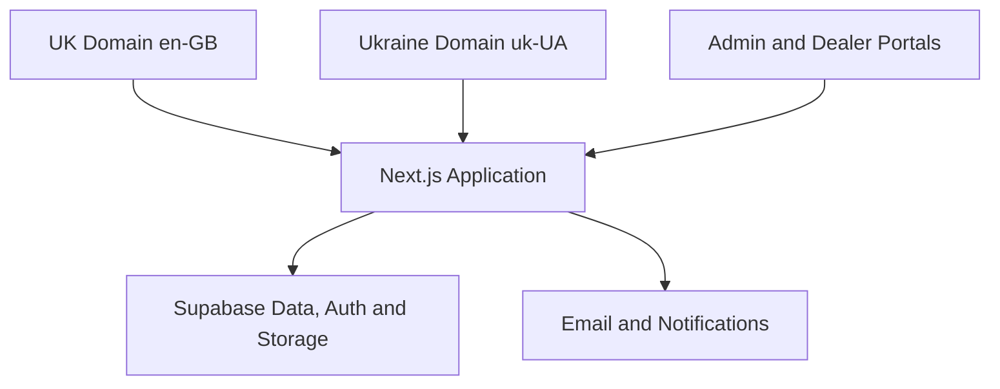

# InfraVolt — UK & Ukraine Master Project Specification

> Document ID: `INF-00`  
> Version: `0.2.0`  
> Status: `Draft for Founder Approval`  
> Product Owner: `Erhan Baydi — Founder / CEO`  
> Delivery Owner: `Product Director / CTO / Head Agent`  
> Required markets: `United Kingdom + Ukraine`  
> Required locales: `en-GB + uk-UA`  
> Domain model: `Separate UK and Ukraine domains, one shared application`  
> Last updated: `15 July 2026`  
> Document language: Turkish; code, route, schema and component identifiers use English.

---

## 1. Belgenin Amacı

Bu belge InfraVolt’un UK ve Ukraine pazarlarını kapsayan dijital ürününün ana şartnamesi, proje anayasası ve üst seviye tek doğruluk kaynağıdır.

Belge aşağıdaki sorulara kesin cevap verir:

- Hangi ürünü geliştiriyoruz?
- Ürün hangi iş problemini çözüyor?
- Hedef kullanıcılar kimlerdir?
- Public website, admin sistemi ve dealer portalında neler olacaktır?
- MVP, V1 ve sonraki sürümler nasıl ayrılacaktır?
- Tasarım ve teknik mimari hangi temel prensiplere uyacaktır?
- Kim hangi kararı verebilir?
- Bir görevin tamamlanmış sayılması için hangi kalite şartları gerekir?
- Ayrıntılı proje dokümanları hangi sırayla hazırlanacaktır?

Bu belge bir database schema, API reference veya component kataloğu değildir. Bu ayrıntılar bağlı dokümanlarda tanımlanır. Bağlı dokümanlar bu belgedeki ürün hedeflerine ve kısıtlamalara aykırı olamaz.

### 1.1 Onaylanmış baseline kararları

| Karar | Baseline |
|---|---|
| Pazarlar | United Kingdom ve Ukraine zorunlu ürün pazarlarıdır |
| Diller | UK için British English (`en-GB`), Ukraine için Ukrainian (`uk-UA`) |
| Domain yaklaşımı | UK ve Ukraine için ayrı domain; tek shared application/codebase |
| Ürün yüzeyleri | Public website + internal admin + dealer/partner portal |
| Satış modeli | B2B quotation ve project supply; public e-commerce değil |
| Teknik kaynaklar | Kontrollü erişim, signed URL ve access/download log |
| Ürün keşfi | Product Comparator + Project List / Quote Basket |
| Tasarım | Açık, kurumsal, teknik ve buyer-friendly; aşırı koyu/crypto/startup değil |
| İlk teslimat | Satışa hizmet eden MVP; portal, 3D, BIM ve ERP özellikleri progressive |
| Uygulama yaklaşımı | Modular monolith, küçük görevler ve quality gates |

Bu baseline kararları yeniden onay alınmadan alt dokümanlarda veya kodda değiştirilemez.

### 1.2 Sürüm geçmişi

| Sürüm | Durum | Değişiklik |
|---|---|---|
| `0.1.0` | Superseded | Initial InfraVolt UK master draft |
| `0.1.1` | Superseded | Ukraine locale ve ayrı domain kararı eklendi |
| `0.2.0` | Current Draft | Belgenin tamamı UK + Ukraine dual-market baseline olarak yeniden düzenlendi |

---

## 2. Karar ve Kaynak Hiyerarşisi

Projede çelişki oluştuğunda aşağıdaki hiyerarşi uygulanır:

1. Founder / Product Owner tarafından onaylanmış güncel iş kararı
2. Bu `00_MASTER_PROJECT_SPEC.md`
3. Onaylanmış Architecture Decision Record (`ADR`)
4. İlgili ayrıntılı proje şartnamesi
5. Task veya issue içindeki acceptance criteria
6. Mevcut kod davranışı

Kodun mevcut olması, kodun doğru olduğu anlamına gelmez. Kod bu belgeyle çelişiyorsa karar belgelenir, ilgili şartname güncellenir ve kod kontrollü şekilde düzeltilir.

Hiçbir agent veya geliştirici sessizce kapsam, mimari, route, rol, veri modeli ya da tasarım sistemi değiştiremez.

---

## 3. Ürün Özeti

InfraVolt, elektrik altyapısı ürünlerini Birleşik Krallık ve Ukrayna pazarlarında tanıtmak, teknik olarak açıklamak, proje ve teklif talepleri toplamak, bayi ağı oluşturmak ve satış operasyonlarını küçük bir ekiple yönetmek için geliştirilen çift pazar destekli B2B satış ve operasyon platformudur.

InfraVolt yalnızca kurumsal tanıtım sitesi değildir. Üç bağlantılı ürün yüzeyinden oluşur:

1. **Public B2B Website** — Müşteri kazanımı, ürün keşfi, sektör çözümleri ve talep toplama
2. **Internal Admin & Sales Operations** — Lead, şirket, teklif, proje, doküman, bayi ve sipariş takibi
3. **Approved Partner / Dealer Portal** — Bayilerin kendi teklif, proje, sipariş ve kontrollü belgelerine erişimi

İlk ticari odak Gersan ürün gruplarıdır. Sistem ileride başka üretici veya ürün markalarının eklenmesine engel olmayacak şekilde tasarlanacaktır.

---

## 4. Ürün Vizyonu

### 4.1 Vizyon

InfraVolt’u Birleşik Krallık ve Ukrayna’daki elektrik altyapısı alıcıları için güvenilir, teknik olarak güçlü ve hızlı cevap veren bir ürün, proje tedariki ve iş ortaklığı platformu haline getirmek.

### 4.2 Misyon

Doğru elektrik altyapısı ürününün doğru projeyle eşleşmesini kolaylaştırmak; katalog, sertifika, teknik danışmanlık, teklif, üretici iletişimi ve sipariş takibini tek bir kontrollü sistemde birleştirmek.

### 4.3 Marka Konumu

InfraVolt şu şekilde algılanmalıdır:

- Modern UK-facing and Ukraine-facing technical sales organisation
- Electrical infrastructure distributor and project supply partner
- Ürün kataloğu paylaşan bir aracıdan daha fazlası
- Teknik sorulara cevap verebilen çözüm ortağı
- Teklif ve proje takibini düzenli yapan güvenilir tedarikçi
- UK ve Ukrayna’da dealer, wholesaler ve project-buyer ağı kurabilecek ölçeklenebilir işletme

### 4.4 Marka İfadesi

Platform markası:

```text
InfraVolt
```

Market-facing çalışma adları:

```text
United Kingdom → InfraVolt UK
Ukraine        → InfraVolt Ukraine (final public wording to be approved)
```

Çalışma sloganı:

```text
Supply • Systems • Solutions
```

Alternatif açıklayıcı ifade:

```text
Electrical Infrastructure Distribution & Project Supply
```

Bu ifadelerin public kullanımı marka ve yetkilendirme kontrolünden sonra kesinleştirilecektir.

---

## 5. İş Bağlamı

InfraVolt’un ilk aşamada sınırlı personelle çalışması beklenmektedir. Bu nedenle ürün yalnızca görünürlük sağlamamalı, operasyon yükünü de azaltmalıdır.

Sistem aşağıdaki ticari ihtiyaçlara hizmet eder:

- Gersan ürünlerini UK ve Ukrayna pazarlarının dili, alıcı profili, doküman ihtiyacı ve doğrulanmış compliance bağlamına uygun biçimde sunmak
- Electrical wholesalers ve trade accounts kazanmak
- M&E contractors, main contractors ve panel builders ile proje fırsatları oluşturmak
- Consultants ve specifiers için teknik güven sağlamak
- Public sector ve tender alıcılarının belge ihtiyaçlarını karşılamak
- Ürün ve teknik doküman taleplerini ölçmek
- Müşteri ihtiyaçlarını çok ürünlü teklif talebine dönüştürmek
- InfraVolt ile üretici arasındaki fiyat ve teknik bilgi akışını takip etmek
- Teklif, proje, sipariş ve sonraki aksiyonları kaybetmeden yönetmek
- Onaylanmış partnerlere kontrollü doküman ve durum erişimi vermek

---

## 6. Temel Ürün İlkeleri

Tüm ürün, tasarım ve teknik kararlar şu ilkelere uymalıdır:

### 6.1 Buyer-first

Site şirketin anlatmak istediklerine göre değil, profesyonel alıcının bulmak istediği bilgiye göre düzenlenir.

### 6.2 Technical trust

Teknik iddialar, standartlar, sertifikalar ve ürün özellikleri yalnızca doğrulanmış kaynaklardan yayınlanır. Eksik bilgi uydurulmaz.

### 6.3 Lead-generating, not brochure-only

Her önemli içerik ziyaretçiyi mantıklı bir sonraki aksiyona yönlendirir: ürün inceleme, karşılaştırma, teknik belge talebi, proje desteği veya teklif talebi.

### 6.4 Controlled resources

Teknik belgeler kontrolsüz public download olarak sunulmaz. Erişim seviyesi, talep kaydı, onay ve download log mantığı uygulanır.

### 6.5 Small-team operability

Bir özellik küçük ekip tarafından sürdürülemiyorsa basitleştirilir veya sonraki sürüme bırakılır.

### 6.6 Progressive delivery

Önce çalışan ve satışa hizmet eden MVP yayınlanır. Dealer portal, gelişmiş order tracking, 3D, BIM ve kapsamlı CRM özellikleri gerçek ihtiyaç doğrulandıkça eklenir.

### 6.7 Security by design

Rol, veri erişimi, private files, audit ve form güvenliği sonradan eklenen işler değildir; tasarımdan itibaren ele alınır.

### 6.8 Accessible and responsive

Public site ve dashboard’lar klavye, mobil, tablet ve farklı ekran boyutlarında kullanılabilir olmalıdır.

### 6.9 No unnecessary complexity

MVP’de microservices, ayrı backend uygulaması, birden fazla storage sağlayıcısı veya gereksiz state-management katmanı kurulmaz.

### 6.10 Evidence over assumption

Ürün isimleri, sertifikalar, performans değerleri, referanslar, teslim süreleri ve ticari ilişki ifadeleri kanıt olmadan yayınlanmaz.

---

## 7. Proje Hedefleri

### 7.1 Birincil hedefler

- InfraVolt için profesyonel ve güvenilir UK dijital varlığı oluşturmak
- Ürünlerin kategori, sektör ve kullanım alanına göre keşfedilmesini sağlamak
- Nitelikli teklif, proje ve dealer başvuruları toplamak
- Product Comparator ve Project List / Quote Basket ile karmaşık talepleri yapılandırmak
- Teknik belge erişimini kontrollü ve ölçülebilir hale getirmek
- Lead’den siparişe kadar temel satış sürecini admin panelinde takip etmek
- Küçük ekibin görev, takip tarihi ve müşteri iletişimini düzenli yönetmesini sağlamak
- UK ve Ukrayna pazarlarını aynı codebase ve ortak operasyon sistemi üzerinden, ayrı domain ve yerelleştirilmiş içerikle desteklemek

### 7.2 İkincil hedefler

- Hangi ürün gruplarına daha fazla talep geldiğini ölçmek
- Hangi sektör içeriklerinin teklif oluşturduğunu görmek
- Teknik doküman eksiklerini ve kullanıcı taleplerini belirlemek
- Üreticiye gönderilen taleplerin cevap sürelerini takip etmek
- Onaylanmış partnerlerin self-service erişimini artırmak

---

## 8. Kapsam Dışı Hedefler

Aşağıdaki özellikler ilk ürün hedefi değildir:

- Public e-commerce checkout
- Public fiyat listesi
- Online kart ödemesi
- Tam muhasebe sistemi
- Tam stok ve warehouse management sistemi
- Freight veya customs management platformu
- Üretim planlama sistemi
- SAP/ERP yerine geçmek
- Her müşteri için özel yazılım geliştirmek
- İlk sürümde native mobile application
- İlk sürümde AI chatbot veya autonomous sales agent
- İlk sürümde tam BIM/Revit model kütüphanesi
- İlk sürümde profesyonel 3D ürün modelleri ve ağır WebGL deneyimi
- Kontrolsüz public CAD, test report, certificate veya price-list indirmesi
- Kanıtlanmamış “exclusive distributor” veya benzeri ticari iddialar

Bu özellikler ancak iş değeri, içerik, bütçe ve operasyon kapasitesi doğrulandığında roadmap’e alınabilir.

---

## 9. Pazar, Dil ve Domain Stratejisi

### 9.1 UK pazarı

Birleşik Krallık, InfraVolt’un ana şirket sunumu ve ilk operasyonel launch pazarıdır. Bu öncelik Ukraine sürümünü isteğe bağlı yapmaz.

Birincil web dili:

```text
British English (en-GB)
```

İçerik yazımında British English kullanılmalıdır:

- centre, colour, organisation
- quotation yerine bağlama göre quote/quotation
- electrical contractor, wholesaler, consultant, specifier gibi UK B2B terminolojisi

### 9.2 Ukrayna pazarı

Ukrayna, sistemin iki zorunlu ürün pazarından biridir. Site Ukraynaca olarak ayrı bir Ukraine-facing domain üzerinden kullanılacaktır. UK ve Ukrayna siteleri iki bağımsız kod projesi olmayacak; aynı codebase, aynı design system ve kontrollü ortak backend altyapısını kullanacaktır.

Ukrayna sürümü yalnızca İngilizce sayfaların mekanik çevirisi olmayacaktır. Gerektiğinde aşağıdaki içerikler pazara göre farklılaştırılabilir:

- Homepage value proposition
- Contact details and responsible market team
- Product availability and priority
- Technical document visibility
- Certifications and compliance explanations
- Project-support and tender messaging
- Forms, consent text and email templates
- References and market-specific announcements

Ukraynaca teknik içerikler yayınlanmadan önce terminoloji ve teknik doğruluk kontrolünden geçmelidir.

Zorunlu locale yapısı:

```text
en-GB — United Kingdom / English
uk-UA — Ukraine / Ukrainian
```

### 9.3 Domain ilkeleri

- `infravolt.co.uk` UK için ana domain olacaktır.
- Ukrayna için ayrı bir `.ua` domain satın alınacak ve aynı uygulamanın `uk-UA` pazar/locale sürümüne bağlanacaktır.
- Kesin Ukraine domain adı satın alma ve uygunluk kontrolünden sonra decision log’a kaydedilecektir.
- `.ua` domain yalnızca `infravolt.co.uk` ana sayfasına yönlenen basit bir redirect olmayacaktır; Ukrainian site experience sunacaktır.
- Her domain kendi varsayılan dilini ve market context’ini açacaktır.
- Kullanıcı görünür market/language switcher ile UK ve Ukraine sürümleri arasında geçebilir.
- Otomatik IP/ülke yönlendirmesi kullanıcıyı zorlamamalıdır.
- Gerekirse market önerisi gösterilir; kullanıcı kendi domain ve dil tercihini koruyabilir.
- UK ve Ukraine domain’leri için canonical, hreflang ve sitemap kuralları ayrı ayrı tanımlanacaktır.
- Domain-based locale resolution, local development ve preview ortamlarında test edilebilir olmalıdır.

### 9.4 Domain ve locale matrisi

```text
infravolt.co.uk → market: UK      → locale: en-GB → currency/context: GBP/UK
Ukraine .ua     → market: Ukraine → locale: uk-UA → currency/context: UAH/Ukraine
```

Public fiyatlandırma MVP kapsamında olmadığı için currency/context bilgisi ilk aşamada yalnızca gelecekteki teklif, içerik ve market kurallarını doğru modellemek amacıyla tutulacaktır.

### 9.5 Ortak ve pazara özel veriler

Ortak tutulabilecek veriler:

- Manufacturer
- Core product taxonomy
- Verified technical specifications
- Base product assets
- Internal companies, leads and operational records

Pazara göre yerelleştirilecek veriler:

- Page copy and metadata
- Product/category descriptions
- Compliance explanations
- Contact and legal information
- CTA and form text
- Email templates
- Resource visibility
- Reference visibility
- Market availability status

Data model yalnızca `language` değil, gerektiğinde `market` bilgisini de desteklemelidir.

---

## 10. Hedef Kullanıcılar

### 10.1 External commercial users

#### Electrical Wholesaler

İlgili ürün gruplarını, ticari uygunluğu, teknik belgeleri ve trade account şartlarını görmek ister.

#### M&E Contractor

Projeye uygun sistemleri, teknik özellikleri, compliance belgelerini ve hızlı teklif desteğini arar.

#### Main Contractor / Infrastructure Contractor

Proje kapasitesi, referanslar, teslimat desteği, paket çözüm ve teknik koordinasyon güveni arar.

#### Panel Builder

Dağıtım paneli, busbar ve bağlantılı sistemler için teknik uygunluk ve ticari teklif ister.

#### Consultant / Specifier

Standart, teknik data, installation yaklaşımı, compliance ve specification desteği arar.

#### Project Buyer / Procurement Team

Doğru ürün, teklif süresi, gerekli dokümanlar, fiyat geçerliliği ve teslimat bilgisi ister.

#### Public Sector / Tender Buyer

Doğrulanabilir belgeler, uygunluk bilgileri, resmi teklif ve izlenebilir iletişim ister.

#### Ukraine Infrastructure / Reconstruction Buyer

Ukraynaca ürün ve proje bilgisi, doğrulanmış teknik doküman, tender desteği, market-specific iletişim ve düzenli quotation süreci ister.

#### Renewable Energy / EV Infrastructure Contractor

Projeye uygun earthing, cable support, distribution ve EV infrastructure çözümleri arar.

### 10.2 External partner users

#### Dealer Applicant

InfraVolt ile ticari ilişki kurmak ve ürün grupları için başvuru yapmak ister.

#### Approved Partner

Onaylı teknik paketlere, kendi taleplerine ve proje iletişimine erişmek ister.

#### Dealer User

Şirketine ait teklifler, siparişler, projeler, fiyat listeleri ve dealer belgelerini görmek ister.

### 10.3 Internal users

#### Sales Admin

Lead, şirket, teklif, takip tarihi ve proje fırsatlarını yönetir.

#### Dealer Manager

Dealer başvurularını, onayları, bölgeleri ve dealer ilişkilerini yönetir.

#### Technical Manager

Ürün teknik bilgilerini, belgeleri, technical questions ve doküman versiyonlarını yönetir.

#### Administrator

Ürün, içerik, talepler, kullanıcılar ve operasyon kayıtlarını yönetir.

#### Super Admin

Rol, permission, sistem ayarları ve kritik yönetim işlemlerinden sorumludur.

Kesin RBAC modeli `09_AUTH_SECURITY_AND_PERMISSIONS.md` içinde tanımlanacaktır.

---

## 11. Ana Kullanıcı İhtiyaçları

Kullanıcıların sistemde tamamlayabilmesi gereken temel işler:

- Ürün gruplarını hızlı anlamak
- Belirli bir sektör veya proje için uygun çözümleri bulmak
- İki veya daha fazla ürünü karşılaştırmak
- Birden fazla ürünü proje listesine eklemek
- Teknik bir soru sormak
- Proje desteği talep etmek
- Teknik katalog, sertifika veya test raporu talep etmek
- Şirket bilgileriyle teklif talebi oluşturmak
- Dealer veya trade account başvurusu yapmak
- Başvuru veya teklif durumunu takip etmek
- Onaylı private belgelere güvenli erişmek
- Admin tarafında bir lead’in bir sonraki aksiyonunu görmek
- Üreticiye gönderilen talebin cevabını takip etmek
- Proje ve sipariş durumunu düzenli güncellemek

---

## 12. Ürün Yüzeyleri ve Modüller

### 12.1 Public B2B Website

Public website şu ana modüllerden oluşur:

- Corporate homepage
- Products library
- Product category pages
- Product series/detail pages
- Industries and sector solutions
- Interactive Application Map
- Technical Resources Centre
- Certifications and compliance presentation
- References / project capability
- UK coverage
- Project support
- Product comparison
- Project List / Quote Basket
- Contact and technical enquiry forms
- Partner / dealer application
- Login entry

### 12.2 Internal Admin & Sales Operations

- Dashboard overview
- Companies and contacts
- Contact enquiries
- Quote requests and quote items
- Technical pack requests
- Dealer applications
- Dealer and partner profiles
- Project opportunities
- Supplier requests to manufacturer
- Orders and order milestones
- Products and product categories
- Documents and access levels
- Industries and Application Map content
- Tasks, reminders and next actions
- Notes and activity history
- Download and access logs
- User and role administration
- Basic reports and exports

### 12.3 Dealer / Approved Partner Portal

- Dashboard
- My Company
- My Quote Requests
- My Orders
- My Projects
- Technical Documents
- Technical Packs
- Support Requests
- Announcements
- Account Settings

Portal features will be released progressively and must only expose data belonging to the authenticated user’s company or authorised project.

---

## 13. Public Information Architecture

Başlangıç route hedefi:

```text
/
├── /products
│   ├── /products/[categorySlug]
│   ├── /products/[categorySlug]/[productSlug]
│   └── /products/compare
├── /project-list
├── /industries
│   └── /industries/[industrySlug]
├── /technical-resources
├── /certifications
├── /references
├── /uk-coverage
├── /project-support
├── /partner-with-us
├── /about
├── /contact
├── /privacy
├── /cookies
└── /terms
```

Protected route hedefi:

```text
/login
/forgot-password
/account
/partner/*
/dealer/*
/admin/*
```

Kesin route ve locale yapısı `02_INFORMATION_ARCHITECTURE_AND_USER_FLOWS.md` ve `05_TECHNICAL_ARCHITECTURE.md` içinde onaylanacaktır.

---

## 14. Homepage Ürün Gereksinimleri

Homepage aşırı yüklenmemeli; ziyaretçiye InfraVolt’un ne sunduğunu hızlıca anlatmalıdır.

Önerilen içerik sırası:

1. Hero — net değer önerisi ve ana CTA
2. Credibility strip — doğrulanmış standart, partnerlik veya kapasite mesajları
3. Core product systems
4. Industries we serve
5. Why InfraVolt / technical sales support
6. Technical resources preview
7. Certifications and compliance preview
8. References or capability evidence
9. UK coverage / project support
10. How we work
11. Partner / trade account invitation
12. Final quote or project-support CTA

Ana CTA’lar:

```text
Explore Products
Build a Project List
Request a Quote
Discuss a Project
Request Technical Documents
```

Ana sayfada uzun ürün listeleri, ağır dashboard benzeri tablolar veya gereksiz animasyonlar kullanılmaz.

---

## 15. Ürün Kapsamı

İlk ürün taksonomisi aşağıdaki ana grupları desteklemelidir:

1. Busbar Trunking Systems
2. Cable Support Systems
3. Distribution Panels and Enclosures
4. Earthing and Lightning Protection
5. Underfloor Trunking Systems
6. LED-BUS / G-BUS and Lighting Busbar Systems
7. Industrial Lighting
8. EV Charging Infrastructure

Busbar başlangıç serileri:

```text
GNL — 25–40A
GL — 40–100A
GM — 100–400A
GGD — 160–1000A
GS — 400–6300A
GR — 500–6000A
```

Akım aralıkları ve bütün teknik bilgiler public yayın öncesinde üretici dokümanlarıyla doğrulanacaktır.

Project-Based Custom Electrical Infrastructure Solutions ayrı bir çözüm alanı olabilir; gerçek bir ürün kategorisi olarak zorunlu değildir.

### 15.1 Ürün içerik standardı

Her ürün veya ürün serisi mümkün olduğunda şu bilgileri destekler:

- Product name
- Manufacturer
- Product category and series
- Short value proposition
- Technical description
- Typical applications
- Suitable industries
- Key benefits
- Materials and finishes
- Ratings and dimensions
- Standards and compliance references
- Product variants
- Technical specification table
- Product images
- Related products
- Related industries
- Related controlled documents
- Request Quote CTA
- Add to Project List CTA
- Compare CTA
- Ask Technical Question CTA

Eksik teknik bilgi boş bırakılır veya “available on request” olarak işaretlenir; üretilmez veya tahmin edilmez.

---

## 16. Sektörler ve Application Map

İlk sektör yapısı:

1. Data Centres
2. Commercial Buildings
3. Industrial Facilities
4. Infrastructure and Utilities
5. Renewable Energy
6. Healthcare
7. Transport and Rail Infrastructure
8. Education and Public Sector

### 16.1 Application Map amacı

Application Map, ürünleri yalnızca katalog kartı olarak değil, gerçek bir tesis veya proje içinde kullanılan sistemler olarak göstermelidir.

Beklenen davranış:

- Overview image
- Product menu
- Clickable hotspots
- Selected-product information panel
- Zone carousel
- Reset view
- Fullscreen view
- Product page, technical pack and quote CTA’ları
- Mobile-friendly alternative list
- Keyboard-accessible interaction

### 16.2 Uygulama stratejisi

- İlk olarak tek bir pilot sektör tamamen hazırlanır.
- Pilot kabul edilmeden sekiz sektörün tamamı kodlanmaz.
- Component yapısı reusable ve data-driven olur.
- Eksik asset veya product mapping uydurulmaz; missing-content listesine eklenir.
- 3D map zorunlu değildir; optimize edilmiş WebP görseller ve hotspot koordinatları MVP için yeterlidir.

Pilot sektör Founder onayıyla seçilecektir. Varsayılan öneri Data Centres veya Commercial Buildings’dir.

---

## 17. Product Comparator

Comparator kullanıcıların belirli bir kategorideki ürünleri anlamlı teknik alanlara göre yan yana incelemesini sağlar.

Temel gereksinimler:

- Yalnızca karşılaştırılabilir ürünler birlikte gösterilir.
- Farklı kategorilerin anlamsız alanları zorla karşılaştırılmaz.
- Teknik alanlar kategoriye göre tanımlanır.
- Bilinmeyen değerler uydurulmaz.
- Kullanıcı karşılaştırmadan Project List’e ürün ekleyebilir.
- Karşılaştırma linki paylaşılabilir olacak şekilde tasarlanabilir.
- Mobilde yatay tablo yerine okunabilir alternatif düzen kullanılır.

Comparator public fiyat karşılaştırma aracı değildir.

---

## 18. Project List / Quote Basket

Project List, e-commerce sepeti değildir. Kullanıcının farklı ürün gruplarını bir proje veya quotation request altında toplamasını sağlar.

Her item mümkün olduğunda şunları destekler:

- Product or series
- Variant or rating
- Quantity
- Unit
- Project reference
- Required specification
- Customer notes
- Supporting attachment reference

Kullanıcı:

1. Ürünleri listeye ekler.
2. Gerekli teknik bilgileri ve miktarı girer.
3. Proje ve şirket bilgilerini ekler.
4. Dosya ekleyebilir.
5. Teklif veya technical review talebi gönderir.
6. Confirmation email alır.
7. Talep admin sistemine structured quote request olarak düşer.

Anonim Project List verisi kısa süreli local state/storage içinde tutulabilir. Sunucuya gönderildiğinde kullanıcıya açıkça bilgi verilir ve yalnızca gerekli veriler kaydedilir.

---

## 19. Technical Resources ve Doküman Erişim Politikası

### 19.1 Temel karar

Teknik dokümanlar kontrolsüz public file URL olarak yayınlanmayacaktır.

Public kullanıcı aşağıdaki metadata bilgilerini görebilir:

- Document title
- Document type
- Related product/category
- Language
- Version or issue date
- File format
- File size
- Access requirement

Dosyanın kendisine erişim access policy üzerinden sağlanır.

### 19.2 Erişim seviyeleri

```text
lead_capture
approved_partner
dealer
project_specific
admin_only
```

`public` access level teknik dokümanlar için varsayılan olmayacaktır. Gerçekten public olması gereken sınırlı marketing asset’leri ayrı bir sınıfta tutulabilir ve Founder/Technical Manager onayı gerektirir.

### 19.3 Temel belge türleri

- Product Catalogue
- Technical Datasheet
- Certificate
- Declaration of Conformity
- Test Report
- Installation Manual
- Maintenance Manual
- Application Guide
- CAD / Technical Drawing
- Tender Document
- Technical Pack
- Project-Specific Document
- Dealer Price List

### 19.4 Download akışı

1. Kullanıcı belge metadata’sını görür.
2. Erişim seviyesine göre form, login veya approval gerekir.
3. Talep ve şirket bilgisi kaydedilir.
4. Yetki doğrulanır.
5. Süreli signed URL üretilir.
6. Erişim veya download olayı kaydedilir.
7. Gerekirse admin notification oluşturulur.

Private URL’ler client code içine hardcode edilmez.

---

## 20. Public Formlar

Planlanan form türleri:

- Contact Form
- Request Quote
- Request Technical Pack
- Ask Technical Question
- Project Support Request
- Dealer / Trade Account Application
- Controlled Document Request

Tüm formlar:

- Client ve server validation kullanır.
- Spam protection içerir.
- Başarılı kaydı veritabanına yazar.
- Admin notification oluşturur.
- Uygunsa kullanıcıya confirmation email gönderir.
- Hata durumunda veri kaybını en aza indirir.
- Gereksiz kişisel veri istemez.
- Consent ve privacy açıklamasını doğru bağlamda gösterir.
- Attachment varsa type, size ve malware-risk politikalarına uyar.
- Submission’ın geldiği `market`, `locale` ve source domain bilgisini güvenli şekilde kaydeder.
- Kullanıcıya market ve diline uygun confirmation mesajı/e-postası gönderir.

Marketing consent operational email onayından ayrı tutulur.

---

## 21. Dealer / Trade Account Başvurusu

Başvuru formu minimum olarak şu bilgi gruplarını destekler:

- Company identity
- Contact person
- Contact details
- Website
- Company type
- Location and coverage
- Business activity
- Interested product groups
- Customer profile
- Project, stock, wholesale or dealer intention
- Estimated purchasing potential
- Supporting file
- Privacy consent

Başvuru lifecycle örneği:

```text
new
under_review
additional_information_required
priority_candidate
approved_partner
approved_dealer
rejected
archived
```

Onay işlemi otomatik olmayacaktır. Internal user başvuruyu inceleyip rol ve şirket erişimini açıkça onaylar.

---

## 22. Satış ve Operasyon Lifecycle

Temel ticari süreç:

```text
Lead Captured
→ Qualified
→ Technical Discovery
→ Supplier Request if required
→ Quote Prepared
→ Quote Sent
→ Negotiation / Revision
→ Won or Lost
→ Order Confirmed
→ Manufacturer / Supply Tracking
→ Dispatch
→ Delivery
→ Closed / After-sales Support
```

Her aşamada şu bilgiler izlenebilir olmalıdır:

- Owner
- Current status
- Last activity
- Next action
- Follow-up date
- Company and contacts
- Related products
- Related project
- Notes and attachments
- Status history

Sistem ilk aşamada tam CRM veya ERP yerine geçmez; InfraVolt’un kendi satış ve proje takibini kaybetmemesini sağlar.

---

## 23. Admin Sisteminin Ana Modülleri

### 23.1 Dashboard

- New enquiries
- Quotes requiring action
- Dealer applications requiring review
- Open project opportunities
- Overdue follow-ups
- Supplier requests waiting for response
- Recent document requests
- Basic conversion and activity indicators
- UK/Ukraine market filters and attribution

### 23.2 Companies and Contacts

- Company profile
- Company type
- Contacts
- Regions and markets
- Interested product groups
- Relationship status
- Notes
- Activity timeline
- Related quotes, projects and orders

### 23.3 Quote Management

- Structured quote requests
- Multiple quote items
- Status and owner
- Technical clarification
- Supplier request link
- Quote validity date
- Revision history
- Internal notes
- Customer communication record
- PDF quotation generation in a later approved phase

### 23.4 Project Opportunities

- Project name and location
- Customer and contractor
- Products and estimated value
- Decision date
- Technical approval state
- Competitor information where lawfully and appropriately recorded
- Opportunity stage
- Next action and responsible user
- Won/lost reason

### 23.5 Supplier Requests

- Link to quote, project or order
- Requested products and quantities
- Technical questions
- Target response date
- Sent date
- Manufacturer response
- Missing information
- Status history

### 23.6 Orders

- Customer and source quote
- Order items
- Status milestones
- Manufacturer reference
- Proforma, invoice and packing-list references
- Dispatch and delivery information
- Customer-visible status text

### 23.7 Document Management

- Upload and validation
- Document metadata
- Product/category linking
- Version management
- Access level
- Expiry or review date
- Archive and replacement
- Download/access logs

### 23.8 Product and Industry Content

- Product status
- Content completeness
- Related industries
- Technical fields
- Document links
- Application Map zones and hotspots
- Publish/unpublish workflow

---

## 24. Dealer / Partner Portal İlkeleri

Portal yalnızca gerçek ticari ihtiyaç doğrulandığında genişletilecektir.

Temel güvenlik ilkeleri:

- Kullanıcı yalnızca bağlı olduğu company verisini görür.
- Project-specific documents yalnızca açıkça yetkilendirilmiş kullanıcıya gösterilir.
- Dealer price lists public URL üzerinden paylaşılmaz.
- Admin notes hiçbir zaman external kullanıcıya gösterilmez.
- Internal ve customer-visible status/notes ayrılır.
- Access değişiklikleri audit edilir.

Portalın ilk sürümü read-heavy olabilir: kullanıcı durumları ve belgeleri görür, sınırlı talepler oluşturur. Karmaşık self-service order editing sonraya bırakılır.

---

## 25. Otomasyon İlkeleri

Otomasyon küçük ekibin tekrar eden işlerini azaltmalıdır; kontrolsüz ticari karar vermemelidir.

Planlanan otomasyon örnekleri:

- Yeni form submission için admin bildirimi
- Kullanıcıya confirmation email
- Dealer application acknowledgement
- Eksik bilgi talebi için şablon
- Follow-up tarihi yaklaşınca reminder
- Quote validity süresi yaklaşınca internal reminder
- Supplier response gecikince reminder
- Order status değişince customer notification
- Yeni uygun belge yayınlanınca ilgili partner notification
- Haftalık open actions özeti
- En çok talep edilen ürün ve doküman raporu

Fiyat, dealer approval, credit terms, commercial commitment veya technical compliance kararı insan onayı olmadan otomatik verilmez.

---

## 26. UI/UX Tasarım Yönü

### 26.1 Görsel karakter

Site şu sıfatlarla tanımlanmalıdır:

```text
professional
technical
credible
premium
clear
buyer-friendly
UK corporate B2B
```

Kaçınılacak görünüm:

```text
crypto
gaming
overly dark
generic AI startup
excessive glassmorphism
unnecessary 3D
animation-heavy marketing site
```

### 26.2 Renk yönü

- White ve light grey ana yüzeyler
- Navy başlık, navigation ve güven duygusu için
- InfraVolt red yalnızca vurgu ve kritik CTA için
- Deep navy sınırlı section veya footer kullanımında
- Teknik çizim/grid hissi veren hafif arka plan detayları

Sayfaların çoğunluğu açık ve ferah görünmelidir.

### 26.3 Tasarım ilkeleri

- Net information hierarchy
- Consistent grid and spacing
- Strong but restrained CTA treatment
- Large, high-quality product imagery
- Readable technical tables
- Mobile-first responsive decisions
- Visible focus states
- Loading, empty, error and success states
- Reduced motion support
- Reusable page templates
- Dashboard’larda estetikten önce görev tamamlama kolaylığı

Kesin UI/UX mimarisi `03_UI_UX_ARCHITECTURE.md`, token ve component kuralları `04_DESIGN_SYSTEM.md` içinde tanımlanacaktır.

---

## 27. İçerik ve Teknik İddia Kuralları

- Product copy British English ile yazılır.
- Teknik değerler resmi üretici dokümanından doğrulanır.
- Sertifika adı ve kapsamı belge görülmeden yazılmaz.
- UKCA, CE, BS, EN veya IEC uygunluğu ürün ve belge bazında belirtilir.
- Bir sertifikanın bütün ürün ailesine ait olduğu varsayılmaz.
- Reference project yayınlamak için kullanım izni ve doğrulama gerekir.
- InfraVolt’un Gersan ile ilişkisi yalnızca yazılı olarak onaylanmış ifadeyle anlatılır.
- “Exclusive distributor”, “official UK distributor” veya benzeri iddialar kanıt/onay olmadan kullanılmaz.
- Placeholder teknik data production’a taşınmaz.
- AI-generated product image gerçek ürün gibi sunulmaz.
- Translation teknik anlamı değiştirmemelidir; kritik içerik human review gerektirir.

Content source, version ve approval bilgisi mümkün olduğunda izlenebilir olmalıdır.

---

## 28. Teknik Mimari Temel Kararları

Bu kararlar ayrıntılı mimari dokümanı hazırlanana kadar yönlendirici ve bağlayıcıdır.

### 28.1 Uygulama yaklaşımı

```text
Modular monolith
```

Public website, admin ve dealer portal aynı Next.js codebase içinde route groups ve domain modülleriyle yönetilir. MVP’de microservices kullanılmaz.

### 28.2 Onaylı başlangıç stack’i

```text
Framework: Next.js App Router
Language: TypeScript
Styling: Tailwind CSS
UI: shadcn/ui + Radix primitives where appropriate
Database: Supabase PostgreSQL
Authentication: Supabase Auth
MVP Storage: Supabase Storage
Forms: React Hook Form + Zod
Server state: TanStack Query where client caching is needed
Small global UI state: Zustand
Local interaction state: React state
Transactional email: Resend
Spam protection: Cloudflare Turnstile
Hosting: Vercel
Testing: Vitest + React Testing Library + Playwright
```

### 28.3 Yasak veya ertelenmiş tercihler

- Redux kullanılmayacaktır.
- Prisma MVP için zorunlu değildir.
- AWS S3 + CloudFront ihtiyaç oluşmadan eklenmeyecektir.
- Public document URLs kullanılmayacaktır.
- Tek bir component için global state eklenmeyecektir.
- Server Component olabilecek içerik gereksiz yere Client Component yapılmayacaktır.
- Anahtarlar, passwords veya gerçek credentials repoya yazılmayacaktır.

### 28.4 Ortamlar

En az şu ortamlar ayrılmalıdır:

```text
Local Development
Preview / Staging
Production
```

Preview build’ler production database, production storage veya production transactional workflows ile kontrolsüz şekilde çalışmamalıdır.

### 28.5 Multi-domain ve localization mimarisi

- UK ve Ukraine siteleri tek codebase üzerinden yönetilecektir.
- Request domain’i market ve default locale seçiminde kullanılacaktır.
- Route, navigation, metadata, sitemap, forms ve email templates market-aware olmalıdır.
- Product technical source data mümkün olduğunda ortak tutulur; çevrilebilir/pazara özel content ayrı modellenir.
- Admin kullanıcıları content’in hangi market ve locale için yayınlandığını açıkça görebilmelidir.
- Bir markette yayınlanan içerik diğer markette otomatik olarak yayınlanmış sayılmaz.
- Missing translation durumunda fallback politikası ilgili UX/content dokümanında belirlenir; production’da kullanıcıya yanlış dilde teknik iddia sessizce gösterilmez.
- UK ve Ukraine leads aynı sistemde tutulabilir; her commercial record `market` veya eşdeğer source context taşımalıdır.

### 28.6 Teknik detayların sahibi

Route groups, folder structure, server/client boundaries, caching, database migrations, API/server actions ve environment schema kararları `05_TECHNICAL_ARCHITECTURE.md` ve ilgili ADR’lerde kesinleştirilir.

---

## 29. Yüksek Seviyeli Sistem Bağlamı



UK ve Ukraine public siteleri, portal ve admin aynı business domain kurallarını kullanır. Market ve locale context request domain’inden belirlenir. Private storage erişimi doğrudan değil, yetki ve market görünürlük kontrolünden sonra sağlanır.

---

## 30. Veri Modeli Yönü

Kesin schema sonraki dokümanda oluşturulacaktır. Master seviyesinde gerekli ana domain’ler:

```text
Identity and Access
Markets, Locales and Translations
Companies and Contacts
Manufacturers
Product Categories, Series, Products and Variants
Product Specifications
Industries and Application Maps
Documents, Versions and Access Grants
Document Requests and Download Logs
Quote Requests and Quote Items
Dealer Applications and Dealer Accounts
Projects and Opportunities
Supplier Requests
Orders and Order Items
Support Requests
Tasks, Notes and Activity History
Notifications
Audit Logs
```

Veri modelinin temel kuralları:

- Quote request birden fazla item destekler.
- Document birden fazla product/category ile ilişkilendirilebilir.
- Company ve contact ayrı entity’lerdir.
- Internal notes ile customer-visible messages ayrıdır.
- Status değişiklikleri mümkün olduğunda history olarak saklanır.
- Soft-delete/archive ihtiyacı domain bazında değerlendirilir.
- Audit gerektiren kritik işlemler actor ve timestamp ile izlenir.
- Technical specifications kategoriye göre genişleyebilir olmalıdır.
- Manufacturer alanı Gersan’a hardcode edilmez.
- Lead, quote, project ve dealer application source market ile ilişkilendirilebilir.
- Çevrilebilir content ile ortak teknik source data birbirinden ayrılır.
- Document visibility hem role/access level hem de market üzerinden kontrol edilebilir.

---

## 31. Authentication ve Yetkilendirme İlkeleri

- Public içerik için login zorunlu değildir.
- Quote veya document request login olmadan yapılabilir; gerekli company/contact bilgisi alınır.
- Dealer ve partner alanları authentication gerektirir.
- Admin alanları internal role gerektirir.
- Route gizlemek güvenlik değildir; server-side authorization ve RLS uygulanır.
- Supabase secret/service-role credential browser’a gönderilmez.
- Default access “deny” yaklaşımı kullanılır.
- Kullanıcı-company bağlantısı doğrulanmadan company data gösterilmez.
- Role changes audit edilir.
- Kullanıcı silme, erişim iptali ve account recovery süreçleri tanımlanır.

Detaylı permission matrix ayrı şartnamede hazırlanacaktır.

---

## 32. Güvenlik ve Privacy İlkeleri

Ürün aşağıdaki kontrolleri desteklemelidir:

- Row Level Security
- Server-side authorization
- Input validation
- Output encoding
- CSRF/replay risk değerlendirmesi
- Rate limiting
- Turnstile validation
- Secure headers and Content Security Policy planı
- Private buckets and signed URLs
- File type and size validation
- Audit logs
- Secret separation
- Environment isolation
- Dependency and vulnerability review
- Backup and recovery planı
- Error messages that do not expose secrets

Privacy yaklaşımı:

- Yalnızca gerekli kişisel veri toplanır.
- Her formun amacı açıkça belirtilir.
- Marketing consent ayrı ve isteğe bağlıdır.
- Retention ve deletion süreleri tanımlanır.
- Privacy, cookie ve terms içerikleri launch öncesi hukuki/iş onayından geçer.
- Analytics ve session-recording araçları consent kararı olmadan production’da etkinleştirilmez.

---

## 33. SEO ve Analytics İlkeleri

### 33.1 SEO

Public ürün ve sektör sayfaları search intent’e göre yapılandırılır.

Minimum gereksinimler:

- Unique title and meta description
- Canonical URL
- Open Graph metadata
- Sitemap
- Robots rules
- Breadcrumbs
- Semantic headings
- Product, organisation ve breadcrumb structured-data değerlendirmesi
- Internal linking
- Image alt text
- British English copy quality
- Locale/hreflang planı

UK ve Ukraine domain’leri ayrı arama pazarı olarak ele alınacaktır. Her domain kendi canonical URL’lerine, sitemap’ine ve doğru `hreflang` eşlemesine sahip olmalı; iki domain arasında yanlış duplicate-content sinyali oluşturulmamalıdır.

### 33.2 Analytics

MVP’de gereksiz araç çoğaltılmaz. Bir temel analytics çözümü ve business-critical events yeterlidir.

Önemli event örnekleri:

```text
product_viewed
comparison_started
product_added_to_project_list
quote_request_submitted
technical_document_requested
document_accessed
project_support_submitted
dealer_application_submitted
application_map_product_selected
```

Sensitive form content analytics metadata’sına gönderilmez.

---

## 34. Non-Functional Requirements

### 34.1 Performance

- Public sayfalar hızlı ve stabil açılmalıdır.
- Görseller optimize ve doğru boyutta sunulmalıdır.
- Application Map asset’leri lazy-load edilmelidir.
- Gereksiz JavaScript client’a gönderilmemelidir.
- Performance budget ayrıntılı dokümanda tanımlanır.

### 34.2 Reliability

- Form submissions tekrar deneme ve idempotency risklerine göre tasarlanır.
- Email başarısızlığı database kaydını yok etmemelidir.
- Kritik kullanıcı işleminde anlaşılır success/error feedback sağlanır.
- Database migrations version-controlled olmalıdır.

### 34.3 Accessibility

- Klavye kullanılabilirliği
- Visible focus
- Semantic HTML
- Form labels and errors
- Colour contrast
- Reduced motion
- Alternative content for visual maps
- Screen-size-independent task completion

Hedef erişilebilirlik standardı detaylı QA dokümanında kesinleştirilecektir.

### 34.4 Maintainability

- Strict TypeScript
- Shared domain types
- Reusable components
- Clear module boundaries
- No duplicated business rules
- Small reviewed changes
- Documented environment variables
- Automated checks

### 34.5 Observability

- Production errors izlenebilir olmalıdır.
- Form ve email failures loglanmalıdır.
- Secret ve kişisel veri loglara yazılmamalıdır.
- Health/operational checks deployment dokümanında tanımlanır.

---

## 35. Release Kapsamları

### 35.1 Foundation Release

- Repository and project foundation
- Documentation structure
- Route skeleton
- Design foundations
- Environment validation
- Development/preview/production separation
- Domain-aware market and locale foundation
- `en-GB` and `uk-UA` translation/content structure
- CI quality checks

### 35.2 Public Website MVP

- Homepage
- About and contact
- Product categories
- Priority product/series pages
- Industries listing
- One pilot Application Map
- Technical Resources metadata pages
- Certifications presentation
- References/capability presentation
- Project support
- Contact and basic quote request
- Responsive design
- Core SEO
- UK domain production configuration
- Ukraine domain configuration readiness
- Visible UK/Ukraine market-language switcher
- Production deployment

### 35.3 Sales Operations MVP

- Product Comparator
- Project List / Quote Basket
- Multi-item quote request
- Technical pack request
- Dealer application
- Supabase persistence
- Transactional emails
- Basic admin authentication
- Admin views for enquiries, quotes and dealer applications
- Status, owner, notes and next action
- Controlled document request flow

### 35.4 Ukraine Market Release

- Separate Ukraine-facing `.ua` domain connected to the shared application
- Ukrainian navigation and core public pages
- Ukrainian product category and priority product content
- Ukrainian industry and project-support content
- Ukrainian forms and transactional email templates
- Market-specific contact, legal and consent content
- Ukraine-specific resource visibility rules
- Domain-specific metadata, canonical, sitemap and hreflang
- Ukrainian technical terminology review
- End-to-end Ukraine lead attribution in admin

Ukrayna release’i teknik olarak V1 portal çalışmalarını beklemek zorunda değildir. Onaylı çeviri, domain ve market content hazır olduğunda UK public MVP’den sonra bağımsız release gate ile yayınlanabilir.

### 35.5 V1

- Full priority product library
- Additional Application Maps
- Companies and contacts
- Project opportunities
- Supplier request tracking
- Document versions and access levels
- Approved partner access
- Basic dealer portal
- Basic order status tracking
- Tasks and reminders
- Reports and CSV exports
- Shared UK/Ukraine operational views and market filtering

### 35.6 Later / Growth

- Advanced dealer portal
- Full quotation PDF workflow
- Advanced order milestones
- Project-specific secure rooms
- Marketing automation
- Advanced analytics dashboards
- S3/CloudFront migration if justified
- ERP/accounting integrations
- BIM/Revit library if official models exist
- Professional 3D product presentation if assets and business value justify it
- AI-assisted internal search or sales support after data quality is proven

---

## 36. Ekip ve Yetki Modeli

### 36.1 Founder / CEO / Product Owner

Sorumluluklar:

- Business vision
- Market and commercial priorities
- Brand and manufacturer relationship wording
- MVP scope approval
- Budget and external service approval
- Public launch approval
- Final acceptance of product releases

### 36.2 Product Director / CTO / Project Manager / Head Agent

Sorumluluklar:

- Business hedefini uygulanabilir ürüne çevirmek
- Roadmap ve backlog yönetmek
- Specialist görevlerini bölmek
- Global architecture ve design consistency korumak
- Scope creep engellemek
- Çıktıları review etmek
- Integration ve quality gates yürütmek
- Risk, dependency ve open decision’ları görünür tutmak
- Founder’a karar gerektiren konuları sunmak

### 36.3 Specialist workstreams

```text
Product and Business Analysis
UX and Information Architecture
UI Design Architecture
Design System
Technical Architecture
Frontend Engineering
Backend and Database Engineering
Auth and Security
Product Content and Technical Documentation
SEO and Analytics
QA, Accessibility and Performance
DevOps and Release
```

Bu workstream’ler aynı anda çalışan zorunlu ayrı agent’lar değildir. Head Agent her aşamada en fazla bir veya iki kontrollü görev alanını aktif eder.

### 36.4 Yetki kuralları

- Designer database schema değiştiremez.
- Frontend engineer yeni global design pattern uyduramaz.
- Backend engineer public user journey’yi sessizce değiştiremez.
- SEO yalnızca launch sonunda çağrılan bir kontrol değildir; page spec aşamasına gereksinim verir.
- QA yalnızca final bug araması değildir; acceptance criteria hazırlanırken devreye girer.
- Specialist package, route, auth, schema veya global tokens değişikliğini Head Agent onayı olmadan yapamaz.
- Founder onayı gerektiren ticari kararlar teknik kolaylık gerekçesiyle varsayılamaz.

---

## 37. Bağlı Proje Dokümanları

Bu Master Spec aşağıdaki dokümanları yönetir:

```text
/docs
├── 00_MASTER_PROJECT_SPEC.md
├── 01_PRODUCT_REQUIREMENTS.md
├── 02_INFORMATION_ARCHITECTURE_AND_USER_FLOWS.md
├── 03_UI_UX_ARCHITECTURE.md
├── 04_DESIGN_SYSTEM.md
├── 05_TECHNICAL_ARCHITECTURE.md
├── 06_DATABASE_AND_DATA_MODEL.md
├── 07_BACKEND_API_AND_WORKFLOWS.md
├── 08_FRONTEND_COMPONENT_SPEC.md
├── 09_AUTH_SECURITY_AND_PERMISSIONS.md
├── 10_CONTENT_SEO_AND_ANALYTICS.md
├── 11_TEST_QA_AND_ACCESSIBILITY.md
├── 12_DEPLOYMENT_AND_OPERATIONS.md
├── 13_PRODUCT_BACKLOG_AND_RELEASE_PLAN.md
└── 14_ARCHITECTURE_DECISION_LOG.md
```

Her doküman:

- Document owner
- Version
- Status
- Last updated
- Dependencies
- Approved decisions
- Open decisions
- Acceptance/sign-off section

içermelidir.

---

## 38. Geliştirme Aşamaları ve Quality Gates

### Gate 0 — Product Scope Approved

Gerekli çıktılar:

- Master Project Spec approved
- MVP/V1 sınırı net
- Target users net
- Product categories net
- Business relationship wording status recorded
- Open decisions list accepted

### Gate 1 — UX and Design Approved

- Sitemap
- User journeys
- Page templates
- Wireframes
- Responsive rules
- Design tokens
- Component inventory
- Key states

### Gate 2 — Architecture Approved

- Folder and route architecture
- Data domains
- Database schema
- Auth and permission model
- Form/API contracts
- Storage model
- Environment model
- Migration strategy

### Gate 3 — Public MVP Ready

- Approved public pages implemented
- Priority content loaded
- Responsive and accessibility QA
- Forms working
- SEO basics working
- No uncontrolled document access
- Production preview approved

### Gate 4 — Sales Operations Ready

- Comparator and Project List working
- Multi-item quote flow working
- Admin authentication and permissions working
- Enquiry and quote management working
- Document request and logging working

### Gate 5 — Partner Operations Ready

- Partner/dealer access tested
- Company-level permissions tested
- Project/order/document visibility tested
- Audit and support flows ready

### Gate 6 — Production Launch Approved

- Security review
- Data/privacy review
- Backup and recovery checks
- Performance and accessibility checks
- Monitoring
- Domain/email/DNS verification
- Founder sign-off

---

## 39. Task Çalışma Standardı

Her implementation task aşağıdaki alanları içermelidir:

```text
Task ID
Objective
Business value
Scope
Out of scope
Dependencies
Allowed files/modules
Acceptance criteria
Security considerations
Accessibility considerations
Test cases
Definition of Done
```

Agent veya geliştirici çalışma sırası:

1. İlgili dosyaları inspect eder.
2. Mevcut durumu özetler.
3. Küçük uygulama planı çıkarır.
4. Yalnızca atanmış kapsamı uygular.
5. Test, lint, typecheck ve build kontrollerini çalıştırır.
6. Değişen dosyaları raporlar.
7. Known issues ve sonraki bağımlılığı belirtir.

---

## 40. Definition of Ready

Bir task kodlamaya hazır sayılmadan önce:

- Business amacı anlaşılır olmalı.
- Kapsam ve kapsam dışı işler yazılmalı.
- Tasarım gerekiyorsa onaylı spec bulunmalı.
- Data/API bağımlılıkları belirlenmeli.
- Acceptance criteria test edilebilir olmalı.
- Gerekli gerçek içerik veya placeholder politikası belli olmalı.
- Security ve permission etkisi değerlendirilmiş olmalı.
- Başka bir aktif task ile dosya çakışması olmamalı.

---

## 41. Definition of Done

Bir task aşağıdaki şartlar sağlanmadan tamamlanmış sayılmaz:

- Acceptance criteria karşılandı.
- Approved design ve product spec’e uyuyor.
- TypeScript error yok.
- İlgili lint/typecheck/build başarılı.
- Kritik logic testleri yazıldı ve geçti.
- Responsive davranış kontrol edildi.
- Keyboard ve form accessibility kontrol edildi.
- Permission ve private-data etkisi test edildi.
- Console error ve broken route/asset yok.
- Secret veya gerçek credential repoda yok.
- İlgili doküman güncellendi.
- Known limitation açıkça raporlandı.

---

## 42. Change Control

Aşağıdaki değişiklikler Architecture Decision Record veya Founder/Head Agent onayı gerektirir:

- MVP/V1 scope değişikliği
- Yeni ücretli external service
- Framework, database veya hosting değişikliği
- Authentication provider değişikliği
- Global route yapısı
- Role/permission modeli
- Database domain boundaries
- Public/private document politikası
- Design-system ana tokenları
- Brand veya manufacturer relationship wording
- Locale/domain stratejisi
- Public pricing veya checkout eklenmesi

Küçük implementation detayları specialist tarafından önerilebilir; ancak master kararlara aykırı olamaz.

---

## 43. Başarı Ölçütleri

İlk 30–90 günlük gerçek trafik sonrasında baseline oluşturulacaktır.

İzlenecek ana göstergeler:

### Acquisition and engagement

- Qualified website visits
- Qualified visits by market and domain
- Product and industry page engagement
- Project List creation rate
- Comparator usage
- Technical resource request rate

### Commercial

- Qualified quote requests
- Dealer/trade applications
- Quote-to-opportunity conversion
- Opportunity-to-win conversion
- Average first-response time
- Overdue follow-up count
- Supplier response time

### Content and product intelligence

- Most requested product categories
- Most requested documents
- Missing-document requests
- Application Map interactions
- Search terms with no result

### Operational quality

- Failed form submissions
- Email delivery failures
- Permission incidents
- Broken document access attempts
- Production errors
- Page performance and accessibility regressions

Vanity metrics tek başına başarı kabul edilmez; qualified commercial outcomes önceliklidir.

---

## 44. Ana Riskler ve Kontroller

| Risk | Etki | Kontrol |
|---|---|---|
| Yetkilendirme ilişkisinin yanlış ifade edilmesi | Hukuki ve ticari güven kaybı | Yalnızca yazılı onaylı wording kullanmak |
| Eksik/yanlış teknik data | Yanlış teklif ve güven kaybı | Source ve technical review zorunluluğu |
| Sertifika kapsamının yanlış sunulması | Compliance riski | Belge-product mapping ve approval |
| Çok geniş MVP | Gecikme ve yarım özellikler | Gate ve scope control |
| Aynı anda çok agent | Kod çakışması | En fazla 1–2 aktif workstream |
| Public private documents | Ticari/güvenlik riski | Private buckets, access policy, signed URLs |
| Preview’ın production’a bağlanması | Veri bozulması | Environment isolation |
| Ağır görsel/3D | Performans ve yayın gecikmesi | MVP’de WebP ve progressive enhancement |
| Admin panelin ERP’ye dönüşmesi | Scope ve bakım yükü | Temel sales operations ile sınırlama |
| Çeviride teknik anlam kaybı | Yanlış bilgi | Human technical review |
| Yanlış domain/locale eşleşmesi | Yanlış dil, SEO ve lead attribution | Domain-aware routing ve market E2E testleri |
| UK içeriğinin Ukrayna’ya kontrolsüz kopyalanması | Yanlış compliance veya ticari mesaj | Market-level publish approval |
| İçerik eksikliği | Boş veya güven vermeyen site | Content inventory ve completeness tracking |

---

## 45. Dış Bağımlılıklar

Proje ilerlemesi için zaman içinde gerekli olacak materyaller:

- InfraVolt logo ve brand assets
- Onaylı company description
- Gersan ilişki/authorization wording
- Official product taxonomy
- Product images and usage rights
- Product catalogues
- Datasheets
- Certificates and declarations
- Test reports
- Installation manuals
- Official technical specifications
- Project/reference permissions
- UK contact and company information
- Ukraine contact and market information
- Approved Ukrainian translations and technical terminology
- Purchased/configured Ukraine-facing `.ua` domain
- Email/domain/DNS access
- Privacy and terms content
- Application Map imagery or approved illustrations

Bu materyaller eksikse sistem development placeholder kullanabilir; ancak placeholder production’da teknik gerçek gibi yayınlanamaz.

---

## 46. Açık Kararlar

Aşağıdaki konular Master Spec’i oluşturmayı engellemez; ilgili aşamadan önce kapatılmalıdır:

1. InfraVolt’un public legal/company name formatı
2. Ukraine-facing public marka adının kesin yazımı
3. Gersan ile ilişkiyi anlatan onaylı İngilizce ve Ukraynaca wording
4. İlk yayınlanacak öncelikli ürün grupları ve ürün serileri
5. Pilot Application Map sektörü
6. Final business mailbox provider
7. Ukraine için satın alınacak kesin `.ua` domain adı ve launch tarihi
8. Public olarak gösterilebilecek sınırlı marketing documents olup olmadığı
9. İlk admin kullanıcıları ve internal roles
10. İlk dealer pilotunun kim olacağı
11. Privacy/cookie/terms final review sahibi
12. Reference projects için yayın izinleri
13. Quote PDF generation’ın MVP mi V1 mı olacağı

Her karar `14_ARCHITECTURE_DECISION_LOG.md` veya ilgili product decision log içinde kaydedilir.

---

## 47. İlk Dokümantasyon Backlog’u

Master Spec onayından sonra çalışma sırası:

1. `01_PRODUCT_REQUIREMENTS.md`
2. `02_INFORMATION_ARCHITECTURE_AND_USER_FLOWS.md`
3. `03_UI_UX_ARCHITECTURE.md`
4. `04_DESIGN_SYSTEM.md`
5. `05_TECHNICAL_ARCHITECTURE.md`
6. `06_DATABASE_AND_DATA_MODEL.md`
7. `07_BACKEND_API_AND_WORKFLOWS.md`
8. `08_FRONTEND_COMPONENT_SPEC.md`
9. `09_AUTH_SECURITY_AND_PERMISSIONS.md`
10. `10_CONTENT_SEO_AND_ANALYTICS.md`
11. `11_TEST_QA_AND_ACCESSIBILITY.md`
12. `12_DEPLOYMENT_AND_OPERATIONS.md`
13. `13_PRODUCT_BACKLOG_AND_RELEASE_PLAN.md`
14. `14_ARCHITECTURE_DECISION_LOG.md`

`01`–`04` ürün ve tasarım temelini oluşturur. Kod iskeleti, ürün kapsamı ve temel UX yönü anlaşılmadan geniş feature development başlamaz.

---

## 48. Master Spec Kabul Kriterleri

Bu belge onaylanmadan önce Founder aşağıdaki maddeleri değerlendirmelidir:

- InfraVolt’un ürün vizyonu doğru mu?
- Public website + admin + dealer portal ayrımı doğru mu?
- Hedef müşteriler doğru mu?
- UK + Ukraine çift pazar ve ayrı domain yaklaşımı doğru mu?
- Ürün grupları doğru mu?
- Controlled document politikası kabul ediliyor mu?
- Comparator ve Project List yaklaşımı doğru mu?
- MVP/V1 ayrımı gerçekçi mi?
- Tasarım yönü markaya uygun mu?
- Teknik temel kabul ediliyor mu?
- Founder ve Head Agent yetkileri doğru mu?
- Açık kararlar eksiksiz mi?

Onay sonrası belge `Approved Baseline` statüsüne alınır. Büyük değişiklikler version artışı ve change-control kaydı gerektirir.

---

## 49. Onay Kaydı

```text
Founder / Product Owner approval: Pending
Approved by:
Approval date:
Approved version:
Notes:
```

---

## 50. Son Karar

InfraVolt, basit bir katalog sitesi olarak geliştirilmeyecektir. Ürün; UK ve Ukrayna pazarlarında ayrı domain ve yerelleştirilmiş içerikle çalışan profesyonel B2B public website, kontrollü teknik kaynak merkezi, structured quote sistemi, küçük ekip için ortak admin/sales operations ve büyümeye hazır dealer portal temelinden oluşacaktır.

İlk başarı ölçütü çok sayıda özellik değil; güvenilir public sunum, nitelikli talepler, düzenli takip ve güvenli doküman erişimidir.

Tüm ayrıntılı tasarım ve teknik kararlar bu Master Project Specification’a bağlı kalacaktır.
