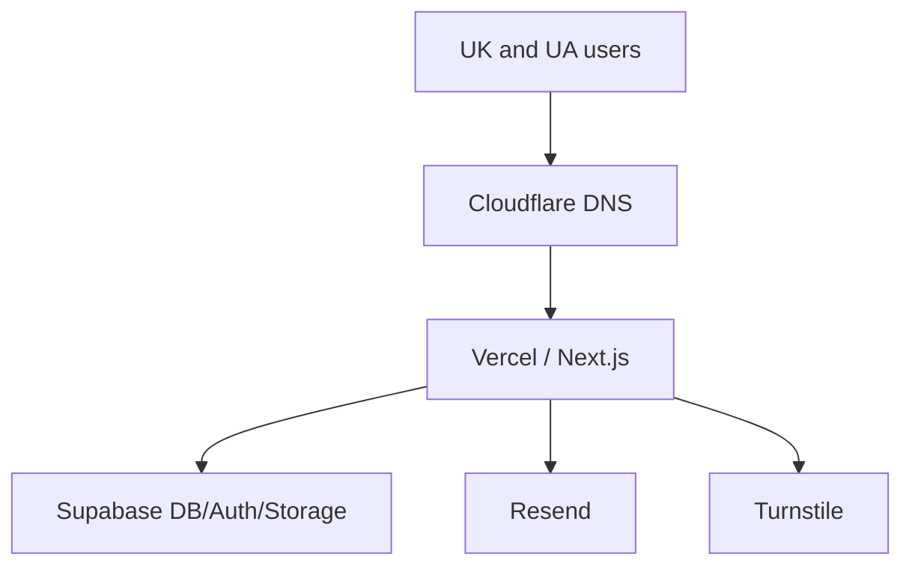
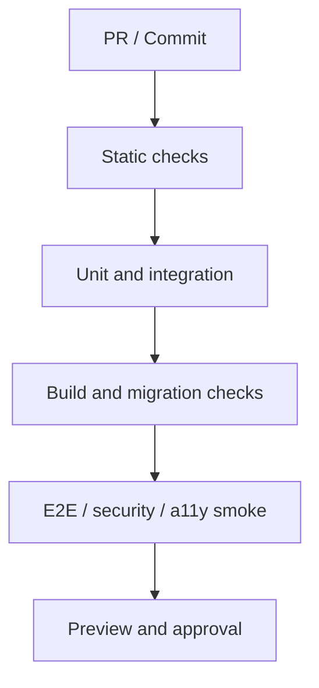
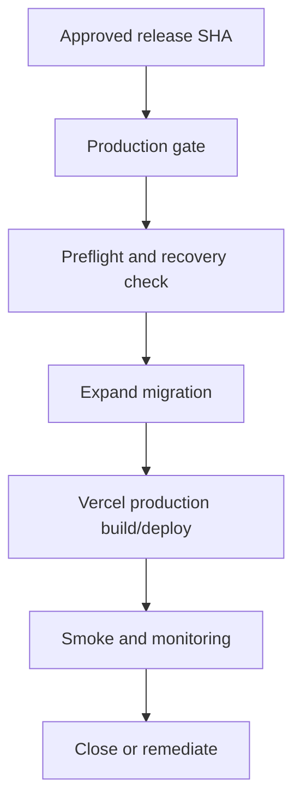
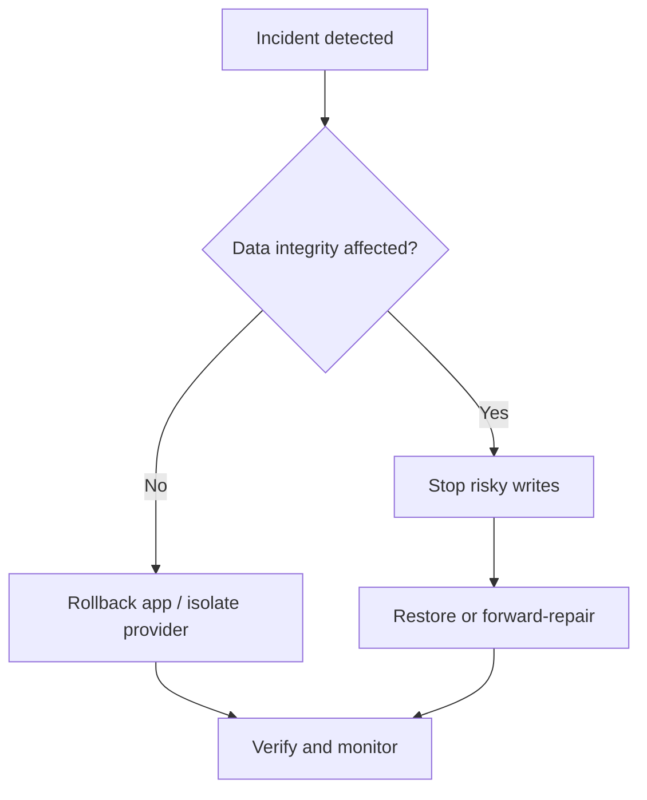

# InfraVolt — DevOps, Deployment and Observability

> Document ID: INF-13  
> Version: 0.1.0  
> Status: Draft for Founder, Product, Engineering, Security and Operations Approval  
> Product Owner: Erhan Baydi — Founder / CEO  
> Operations Owner: Product Director / CTO / Head Agent  
> Release Owner: Engineering Lead / Authorized Release Manager  
> Security Owner: Technical Owner / Security Reviewer  
> Data Recovery Owner: Technical Owner + Founder-approved Provider Administrator  
> Parent documents: 00_MASTER_PROJECT_SPEC.md v0.2.0, 01_PRODUCT_REQUIREMENTS.md v0.1.0, 02_INFORMATION_ARCHITECTURE_AND_USER_FLOWS.md v0.1.0, 03_UI_UX_ARCHITECTURE.md v0.1.0, 04_DESIGN_SYSTEM.md v0.1.0, 05_TECHNICAL_ARCHITECTURE.md v0.1.0, 06_DATABASE_SCHEMA.md v0.1.0, 07_BACKEND_API_AND_WORKFLOWS.md v0.1.0, 08_ADMIN_AND_SALES_OPERATIONS.md v0.1.0, 09_PARTNER_PORTAL.md v0.1.0, 10_AUTH_SECURITY_AND_PERMISSIONS.md v0.1.0, 11_CONTENT_SEO_AND_ANALYTICS.md v0.1.0, 12_TEST_QA_AND_ACCESSIBILITY.md v0.1.0  
> Application platform: Vercel  
> Application runtime: Next.js 16 App Router + Node.js 24 + TypeScript  
> Data platform: Supabase PostgreSQL + Auth + Storage  
> Transactional email: Resend through application outbox  
> DNS/security edge baseline: Cloudflare DNS + Vercel application delivery  
> Source control and CI baseline: GitHub + protected branches + GitHub Actions/Vercel checks  
> Required production markets: United Kingdom + Ukraine  
> Last updated: 15 July 2026  
> Document language: Turkish; code, environment, event, metric, alert and runbook identifiers use English.

---

## 1. Belgenin Amacı

Bu belge InfraVolt’un production’a güvenli biçimde çıkma ve production’da çalışır halde kalma sözleşmesini tanımlar.

Belge:

- infrastructure ve provider sınırlarını,
- source control ve branch governance’ını,
- local, preview, staging ve production environment’larını,
- CI/CD ve release approval hattını,
- Next.js/Vercel deployment davranışını,
- Supabase migration ve database release sırasını,
- UK/Ukraine domain, DNS, SSL ve email DNS operasyonlarını,
- environment variable ve secret lifecycle’ını,
- scheduled/background job işletimini,
- log, metric, trace, business ve security telemetry’sini,
- SLI, SLO, alert ve dashboard’ları,
- backup, point-in-time recovery, storage copy ve restore testlerini,
- incident classification, communication ve runbook’ları,
- capacity, cost, quota, dependency ve lifecycle yönetimini,
- launch, release, rollback ve disaster recovery checklist’lerini

kesinleştirir.

Bu belge bir “Vercel’e deploy et” notu değildir. InfraVolt’un küçük ekiple güvenli, gözlemlenebilir ve geri kazanılabilir işletim modelidir.

---

## 2. Ana Karar

InfraVolt MVP/V1 production mimarisi:

- tek Git repository,
- tek deploy edilen Next.js modular monolith,
- tek Vercel project,
- UK public domain,
- Ukraine public domain,
- tek protected application host,
- ayrı Supabase staging ve production projects,
- source-controlled immutable migrations,
- environment-isolated credentials,
- database-first durable business records,
- asynchronous email outbox,
- structured privacy-safe telemetry,
- tested application rollback ve data recovery

ile işletilecektir.

Kubernetes, custom servers veya microservice platformu MVP baseline değildir.

---

## 3. Numaralandırma Uyumluluk Notu

Önceki belgelerin bazı draft bölümlerinde bu doküman `13_DEPLOYMENT_AND_OPERATIONS.md` adıyla anılmıştır.

Kanonik dosya:

`13_DEVOPS_DEPLOYMENT_AND_OBSERVABILITY.md`

olarak kabul edilir.

Eski placeholder referansları bu belgeyi işaret eder.

---

## 4. Operations Product Promise

Production operations şu business sonuçlarını korur:

1. Public site doğru market ve locale ile erişilebilir kalır.
2. Quote, dealer ve document request kayıtları kaybolmaz.
3. Partner company verisi başka company’ye açılmaz.
4. Approved content doğru domain’de yayınlanır.
5. Private documents kontrolsüz public URL’ye dönüşmez.
6. Provider arızası mümkün olduğunda izole edilir.
7. Incident anlaşılır, sahiplenilir ve geri kazanılır.
8. Release’in hangi code/schema/config ile çalıştığı bilinir.

---

## 5. Operations Principles

### 5.1 Automate repeatable work

Tekrarlanan deploy, migration, test ve verification adımları kişisel hafızaya bırakılmaz.

### 5.2 Production is a protected system

Production credentials, data ve destructive controls günlük development aracı değildir.

### 5.3 Same source, different configuration

UK, UA, preview ve production için ayrı code fork’u oluşturulmaz.

### 5.4 Expand before contract

Schema önce backward-compatible genişletilir; destructive cleanup ancak eski code devreden çıktıktan sonra yapılır.

### 5.5 Rollback is not database time travel

Application deployment rollback’i database mutation’ını otomatik geri almaz.

### 5.6 Observe business outcomes

“Server ayakta” tek başına yeterli değildir; quote durable save veya document authorization da ölçülür.

### 5.7 Backup is not recovery

Restore edilmemiş backup güvence sayılmaz.

### 5.8 Default deny

Environment, secret, provider ve release yetkileri minimum tutulur.

### 5.9 No silent failure

Failed deploy, dead outbox, backup gap veya wrong-domain content alert/owner olmadan kalmaz.

### 5.10 Vendor-aware, not vendor-locked

Vercel/Supabase kullanılır; application domain contracts ve telemetry mümkün olduğunca provider-neutral tutulur.

---

## 6. Kapsam

### 6.1 Dahil

- Source repository and branch protection
- CI and CD workflows
- Vercel project/environments/deployments
- Supabase local/staging/production
- Database migrations and types
- Auth and Storage environment operations
- Domains, DNS, TLS and email DNS
- Environment variables and secrets
- Background jobs and cron
- Logs, metrics, traces and dashboards
- Alerts and operational ownership
- Backup, restore and disaster recovery
- Incident response and postmortems
- Cost, quota, capacity and provider lifecycle
- Release and production readiness

### 6.2 Kapsam dışı

- Gersan corporate infrastructure operations
- Electrical product manufacturing operations
- Employee device/MDM full program
- Enterprise SIEM/SOC
- Kubernetes/container orchestration
- Multi-region active-active database
- Native mobile release operations
- Full ERP/CRM operations

---

## 7. Platform Responsibility Matrix

| Capability | Primary provider/system | InfraVolt responsibility |
|---|---|---|
| Source code | GitHub | Access, review, branch protection, retention |
| Application build/runtime | Vercel | Correct config, tests, limits, rollback, monitoring |
| Database | Supabase PostgreSQL | Schema, RLS, migration, query, backup policy |
| Authentication | Supabase Auth | Redirects, session policy, account operations |
| File storage | Supabase Storage | Bucket policy, object lifecycle, independent backup |
| Email delivery | Resend | Outbox, idempotency, sender DNS, webhook/retry |
| DNS | Cloudflare baseline | Record accuracy, access, DNSSEC decision, change control |
| TLS | Vercel/provider-managed | Host verification, renewal monitoring, redirect policy |
| Anti-bot | Cloudflare Turnstile | Key isolation, server validation, fallback |
| Analytics | Approved adapter/provider | Privacy, environment separation, event correctness |
| Business audit | InfraVolt database | Integrity, access, retention, operational review |

Managed provider kullanmak InfraVolt’un configuration ve recovery sorumluluğunu kaldırmaz.

---

## 8. Production Topology



Tek application request host’unu allowlist üzerinden market/locale context’ine çevirir.

---

## 9. Canonical Production Hosts

| Purpose | Host | Status |
|---|---|---|
| UK public | `infravolt.co.uk` | Required canonical |
| UK alias | `www.infravolt.co.uk` | Redirect to canonical |
| Ukraine public | Exact `.ua` domain TBD | Founder/DNS/legal decision required |
| Ukraine alias | Based on purchased domain | Redirect policy after purchase |
| Protected Admin/Portal/Auth | Exact app host TBD | Single canonical protected host recommended |

Ukraine placeholder production config’e gerçek domain gibi yazılmaz.

---

## 10. Regional Architecture Decision

Application ve Supabase primary region seçimi:

- UK ve Ukraine user latency,
- data residency/legal review,
- provider availability,
- backup capability,
- cost,
- supportability

ile belirlenir.

MVP baseline tek primary region’dır. Multi-region write replication yoktur.

Exact region production project oluşturulmadan ADR ile kaydedilir.

---

## 11. Environment Model

| Environment | App | Database/Auth/Storage | Data | Purpose |
|---|---|---|---|---|
| Local | Local Next.js | Supabase CLI local | Synthetic | Development |
| CI ephemeral | CI build/test | Fresh local stack | Deterministic synthetic | Merge gate |
| Preview | Vercel Preview | Ephemeral branch or non-prod project | Synthetic | PR review |
| Staging | Stable Vercel custom env/branch | Dedicated persistent staging | Representative synthetic | Release rehearsal |
| Production | Vercel Production | Dedicated production | Live | Customer/business operation |

---

## 12. Environment Isolation Rules

- Preview/staging production database’e bağlanamaz.
- Production key non-production environment’a kopyalanamaz.
- Production Auth users staging’e export edilmez.
- Storage buckets environment-specific olur.
- Test email safe sink/allowlist dışına çıkmaz.
- Turnstile test keys production’da kullanılmaz.
- Analytics non-production traffic’i production report’una karıştırmaz.
- Cron secret environment-specific olur.
- Webhook endpoint/secret environment-specific olur.
- Search engine indexing production public hosts ile sınırlanır.

---

## 13. Local Development Contract

Local setup:

- pinned Node.js major/minor policy,
- pinned pnpm version,
- committed lockfile,
- Supabase CLI,
- Docker-compatible local runtime,
- `.env.local`,
- deterministic seed,
- UK/UA local host mapping,
- provider mocks/test keys

kullanır.

Developer production database’e local application ile bağlanmaz.

---

## 14. Local Host Simulation

Önerilen local host’lar:

```text
uk.infravolt.localhost
ua.infravolt.localhost
app.infravolt.localhost
```

Fallback environment override yalnız local/preview’da kullanılır.

Production market resolution trusted host allowlist’e dayanır; query parameter production authority değildir.

---

## 15. Preview Environment Contract

Her pull request mümkün olduğunda:

- unique Vercel preview URL,
- exact commit SHA,
- non-production database branch/project,
- synthetic seed,
- noindex/access protection,
- test provider keys,
- email recipient allowlist,
- preview banner/environment indicator

alır.

Preview URL private security boundary değildir; sensitive data içermez.

---

## 16. Supabase Preview Branch Decision

Supabase branching kullanılabiliyorsa:

- her branch ayrı credentials alır,
- preview branch data-less başlar,
- seed synthetic olur,
- PR close sonrası cleanup edilir,
- production data copy edilmez.

Branching cost/capability uygun değilse preview’lar shared staging project kullanabilir; test worker/entity isolation zorunludur.

Shared staging, security testinin production üzerinde çalıştırılmasını meşrulaştırmaz.

---

## 17. Staging Contract

Staging:

- persistent,
- production-like schema/config,
- separate credentials,
- representative synthetic data,
- stable hostname,
- protected from indexing,
- controlled reviewer access,
- email safe sink/allowlist,
- release rehearsal target

olur.

Staging demo content’i gerçek certification veya customer evidence gibi sunmaz.

---

## 18. Production Contract

Production:

- live business data,
- canonical domains,
- real provider endpoints,
- restricted admin ownership,
- backup/recovery controls,
- alerting,
- audit,
- documented change process,
- tested smoke and rollback

ile çalışır.

Production Dashboard manual edit, normal delivery yöntemi değildir.

---

## 19. Source Control Baseline

- One private Git repository
- Protected default branch
- Required pull requests
- Required CI status checks
- Required review for sensitive paths
- Commit history retained
- Signed commits/tags optional based on team maturity
- No secrets or production exports
- Release tags immutable by policy

Repository ownership tek kişisel hesaba bağımlı bırakılmaz.

---

## 20. Branch Strategy

Initial strategy:

| Branch | Purpose | Deployment |
|---|---|---|
| `main` | Production truth | Production candidate/release |
| `develop` | Persistent staging integration | Staging |
| `feature/*`, `fix/*` | Short-lived work | Preview |
| `hotfix/*` | Urgent production fix | Preview → expedited main |

Rules:

- Direct push to `main` and `develop` prohibited.
- `develop` regularly syncs with `main`.
- Long-lived feature branches avoided.
- If team size remains small and `develop` creates drift, ADR ile trunk-based `main + preview` modeline geçilir.

---

## 21. Protected Paths

Extra reviewer/owner required:

- `.github/workflows/**`
- `supabase/migrations/**`
- `supabase/config.toml`
- auth/authorization modules
- RLS/policy SQL
- `vercel.json`
- environment schema
- CSP/security headers
- document access code
- observability redaction
- deployment scripts

CODEOWNERS-equivalent policy repository’de uygulanır.

---

## 22. Commit and Pull Request Contract

PR:

- concise scope,
- linked requirement/issue,
- risk class,
- migration/config impact,
- screenshot/evidence where relevant,
- rollback/forward-fix note for high risk,
- test results,
- security/accessibility review flags

içerir.

Unreviewable “mega PR” release riskidir.

---

## 23. Release Versioning

Application release identity:

```text
semantic version + git SHA + Vercel deployment ID + database migration head
```

Örnek:

```text
appVersion=0.8.0
gitSha=abc1234
deploymentId=dpl_...
dbMigration=202607151430_add_quote_outbox
```

Public response secret içermeden build identity sağlayabilir; protected operational detail internal health/debug surface’te tutulur.

---

## 24. Release Types

| Type | Scope | Approval |
|---|---|---|
| Standard | Normal feature/fix | Required checks + release owner |
| Content-only | Approved content/config without schema | Content + standard smoke |
| Database | Migration/data change | Database/security review + rehearsal |
| Hotfix | Active high-severity incident | Expedited review + post-review |
| Security | Vulnerability/secret/auth change | Security owner + restricted communication |
| Infrastructure | DNS/provider/env/workflow | Technical owner + rollback plan |

---

## 25. CI Pipeline Stages



Independent read-only jobs parallel çalışabilir; state-changing release jobs ordered olur.

---

## 26. Required CI Commands

Minimum:

```bash
pnpm install --frozen-lockfile
pnpm lint
pnpm typecheck
pnpm test
pnpm build
pnpm test:e2e:smoke
```

Database scope’unda ek:

```bash
supabase start
supabase db reset
supabase migration list
supabase gen types typescript --local
```

Exact scripts repository package commands içine standardize edilir.

---

## 27. CI Reproducibility

- Node version file/package engine pinned
- pnpm version pinned through Corepack/package manager field
- lockfile immutable install
- timezone and locale explicit where needed
- fresh database
- deterministic seed
- cached dependencies never replace integrity check
- generated file drift fails
- environment schema validated
- CI image/runtime updates reviewed

“Localde geçti” CI failure’ını kapatmaz.

---

## 28. CI Secret Rules

- Repository secrets encrypted store’da
- Production secrets only production environment/job
- Pull requests from untrusted fork secret alamaz
- Secret values masked but masking’e tek savunma olarak güvenilmez
- Shell debug/xtrace secret jobs’da kapalı
- No secret in artifact/cache
- Short-lived/OIDC provider credentials preferred where supported
- Personal access token minimum scope ve expiry ile

---

## 29. Supply Chain Controls

- Lockfile committed
- Package integrity verified by package manager
- Minimal dependencies
- Dependency advisory scan
- Renovation/update automation may open PR; auto-production merge yok
- GitHub Action dependencies pinned to trusted version/commit policy
- Build provenance/artifact metadata retained where available
- New package owner/maintenance/license review
- Typosquatting check for unfamiliar package

---

## 30. Preview Deployment Flow

1. Feature branch push/PR.
2. CI static/unit/integration checks.
3. Database preview branch/schema prepared if needed.
4. Vercel preview build from exact SHA.
5. Smoke, accessibility and changed-scope E2E.
6. Product/design/content review.
7. Preview expires/cleans after PR close according to retention.

Failed required check preview’ı production adayı yapamaz.

---

## 31. Staging Deployment Flow

1. PR merged to protected `develop`.
2. Staging migration preflight.
3. Pending migrations apply to staging.
4. Staging application deploys from exact SHA.
5. Seed/update synthetic fixtures.
6. Critical regression and production-like checks.
7. Release candidate evidence generated.

Staging migration production’dan önce en az bir kez fresh ve existing-state path’te test edilmiş olmalıdır.

---

## 32. Production Release Flow



Source SHA, production environment variables ve migration head release record’ında tutulur.

---

## 33. Production Gate

Required:

- all release-blocking tests green
- approved PR/release candidate
- no unresolved SEV-0/SEV-1 blocker
- migration reviewed/rehearsed
- backup/PITR state verified for data-risk change
- environment/config diff reviewed
- UK/UA content/domain impact reviewed
- release owner assigned
- monitoring/rollback window available
- production smoke script ready

---

## 34. Deployment Promotion Semantics

Preview’dan production’a aynı source SHA promote edilir.

Vercel production promotion/rebuild production environment variablesını kullanabilir; bu nedenle:

- source identity same,
- build environment explicitly different,
- production build yeniden doğrulanmış,
- environment schema same contract,
- post-deploy smoke mandatory

olur.

Binary artifact’in birebir aynı olduğu varsayılmaz.

---

## 35. Deployment Checks

Platform capability/plan destekliyorsa production domain assignment şu checks geçene kadar tutulur:

- build success
- required CI
- migration success
- smoke/health
- security/accessibility critical gates
- manual approval for high-risk release

Capability yoksa eşdeğer gated GitHub Actions/CLI release workflow uygulanır.

---

## 36. Deployment Concurrency

- One production release at a time
- Older pending deployment newer approved release’i overwrite etmez
- Migration job serialized
- Hotfix release active normal release ile koordine edilir
- Cron/backfill deploy sırasında state-safe olur
- Release lock stale kalırsa audited override gerekir

---

## 37. Change Freeze

Temporary freeze uygulanabilir:

- active incident
- major provider degradation
- high-risk migration sonrası observation window
- launch day stabilization
- DNS/domain transfer
- recovery exercise

Emergency security hotfix freeze dışında explicit exception ile ilerler.

---

## 38. Application Rollback

Application rollback:

- prior known-good Vercel deployment’a domain’i geri yönlendirebilir,
- exact deployment identity kullanır,
- release owner approval veya incident commander kararı alır,
- smoke test ile doğrulanır,
- cron configuration separately checked,
- database compatibility kontrol edilir.

Rollback sonrası root-cause ve forward release hazırlanır.

---

## 39. Rollback Limitations

Application rollback şunları geri almaz:

- applied database migration
- data mutation
- sent email
- external webhook effect
- deleted/overwritten storage object
- DNS propagation
- rotated/revoked secret
- third-party config change

Bu etkiler için ayrı compensation/recovery runbook gerekir.

---

## 40. Roll-Forward Default

Database veya data issue’da default:

1. Writes stop/feature disabled if necessary.
2. Scope and damage assessed.
3. Safe corrective migration/script prepared.
4. Backup/restore point verified.
5. Fix rehearsed on representative isolated copy.
6. Forward fix applied.
7. Data integrity checked.

Destructive “down migration” default değildir.

---

## 41. Feature Flags

Feature flag uses:

- incomplete UI hidden safely
- progressive enablement
- provider integration switch
- emergency kill switch
- market-specific launch
- dark launch/observation

Rules:

- server authorization’dan bağımsız değildir
- owner and expiry
- default safe state
- audit for sensitive changes
- removed after stabilization
- environment and market scope explicit

---

## 42. Kill Switches

Minimum candidates:

- public attachment upload
- document download issuance
- external email sending
- UA public publication
- analytics provider
- expensive search/map feature
- noncritical background jobs

Quote durable database capture tamamen kapatılmadan önce business continuity path gerekir.

---

## 43. Database Migration Source of Truth

- `supabase/migrations/**`
- immutable after shared environment apply
- correction by new migration
- timestamped names
- reason/issue linkage
- code review
- local reset test
- staging rehearsal
- production log retention

Dashboard-only production schema change yasaktır.

---

## 44. Migration Categories

| Category | Example | Risk |
|---|---|---|
| Additive | nullable column, new table/index | Lower |
| Constraint | check/not-null/unique/FK | Medium/high |
| Policy | RLS/grant/function | High/security |
| Data backfill | derived field/population | Medium/high |
| Destructive | drop/rename/type rewrite | High |
| Performance | concurrent index/query helper | Medium |
| Provider config | Auth/Storage/Vault config | High |

Risk category review/gate’i belirler.

---

## 45. Expand–Migrate–Contract Pattern

### Release A — Expand

- new nullable/additive schema
- old code remains functional

### Release B — Migrate

- dual-read/write if needed
- bounded backfill
- consistency metrics

### Release C — Contract

- old code removed
- verified no dependency
- destructive cleanup later release

Tek deployment içinde risky rename/drop yapılmaz.

---

## 46. Migration Preflight

- current migration head verified
- no unexpected drift
- target project identity verified
- backup/PITR availability checked
- lock/runtime estimate
- affected row count
- index/constraint impact
- RLS/grant diff
- old/new app compatibility
- abort criteria
- owner and maintenance window

Production project ID human-readable confirmation olmadan destructive script çalışmaz.

---

## 47. Migration Execution

- CI-controlled non-interactive job
- least-privilege migration credential where practical
- serialized execution
- command and migration names logged
- secret values excluded
- statement/lock timeout where appropriate
- no unbounded backfill in request deployment step
- failure stops dependent deployment

Local laptop’tan ad hoc production migration yalnız documented break-glass incident path’inde mümkündür.

---

## 48. Large Backfill

- separate operational job
- small bounded batches
- resumable cursor
- idempotent update
- rate/lock monitoring
- pause/kill control
- progress metric
- no user request timeout dependency
- validation sample/count

Backfill completion deploy success’ından ayrı izlenir.

---

## 49. Index and Lock Management

- representative query plan before/after
- table size estimate
- concurrent index capability considered
- long transaction avoided
- lock timeout
- peak traffic avoided for risky DDL
- blocking session monitoring
- rollback/abort decision

“Small now” future scale için review ihtiyacını kaldırmaz.

---

## 50. RLS and Grant Deployment

Policy migration:

- default deny preserved
- grants explicit
- anon/authenticated/service behavior tested
- company A/B negative tests
- internal market scope tests
- storage policy tests
- Security Advisor/manual review
- query performance plan

RLS’yi geçici kapatmak fix yöntemi değildir.

---

## 51. Generated Database Types

Migration sonrası:

1. Types generated from local schema.
2. Diff reviewed.
3. Application typecheck runs.
4. Generated types committed or deterministic CI artifact policy applied.
5. Production schema drift check remains independent.

Manual duplicate row interfaces azaltılır.

---

## 52. Schema Drift Detection

Detect:

- migration history mismatch
- dashboard-only DDL
- missing RLS
- unexpected grants
- function definition drift
- Auth/Storage config drift
- generated type drift

Drift production’da otomatik overwrite edilmez; triage ve reconciliation gerekir.

---

## 53. Seed Management

| Seed type | Environment | Content |
|---|---|---|
| Development | Local | Full synthetic fixtures |
| CI | Ephemeral | Deterministic minimum + risk matrix |
| Preview | Non-prod | Feature-specific synthetic |
| Staging | Non-prod | Representative synthetic |
| Production | Production | Only approved reference/config bootstrap |

Production seed sample user/customer oluşturmaz.

---

## 54. Environment Variable Architecture

Variables three classes:

1. Public build/runtime config
2. Server-only secret/config
3. Operational CI/provider credentials

Public prefix secret olmadığını garanti etmez; yalnız browser’a açılacağını belirtir.

---

## 55. Public Environment Variables

Baseline:

```env
NEXT_PUBLIC_SITE_URL_UK=
NEXT_PUBLIC_SITE_URL_UA=
NEXT_PUBLIC_PROTECTED_APP_URL=
NEXT_PUBLIC_SUPABASE_URL=
NEXT_PUBLIC_SUPABASE_PUBLISHABLE_KEY=
NEXT_PUBLIC_TURNSTILE_SITE_KEY=
```

Public variable’a email provider key, service key, secret veya internal endpoint credential yazılmaz.

---

## 56. Server-Only Environment Variables

Baseline:

```env
SUPABASE_SECRET_KEY=
RESEND_API_KEY=
RESEND_WEBHOOK_SECRET=
TURNSTILE_SECRET_KEY=
CRON_SECRET=
EMAIL_FROM_UK=
EMAIL_REPLY_TO_UK=
EMAIL_FROM_UA=
EMAIL_REPLY_TO_UA=
LOG_LEVEL=
```

Legacy Supabase `service_role` equivalent yalnız server-only transitional path’tir.

---

## 57. Operational CI Secrets

Örnek:

```env
SUPABASE_ACCESS_TOKEN=
STAGING_PROJECT_ID=
STAGING_DB_PASSWORD=
PRODUCTION_PROJECT_ID=
PRODUCTION_DB_PASSWORD=
VERCEL_ORG_ID=
VERCEL_PROJECT_ID=
VERCEL_TOKEN=
```

OIDC/short-lived provider auth desteklenirse long-lived token yerine tercih edilir.

---

## 58. Environment Schema Validation

- client and server schemas separate
- URL/host normalized
- enum values explicit
- required-by-environment rules
- no secret value in error
- production placeholder rejected
- test key rejected in production
- production endpoint rejected in CI/preview
- startup/build fail fast for critical missing config

Optional provider disabled state explicit olur.

---

## 59. `.env.example` Contract

- variable names
- safe description
- public/server classification
- required environments
- placeholder blank or clearly fake
- no real ID/token/password
- updated in same PR as new variable

`.env.local` and environment-specific secret files gitignored olur.

---

## 60. Secret Ownership

Her secret için registry:

- name/classification
- provider
- purpose
- environments
- owner
- consumers
- creation date
- rotation/revocation method
- last rotation/review
- emergency contact

Actual secret value registry document’ında tutulmaz.

---

## 61. Secret Rotation

Rotation triggers:

- suspected exposure
- employee/contractor departure
- provider ownership change
- scope change
- weak/legacy key migration
- scheduled risk-based review

Procedure:

1. Create new credential.
2. Deploy dual-valid configuration if supported.
3. Verify.
4. Revoke old.
5. Monitor.
6. Record audit.

---

## 62. Secret Leak Response

- treat as compromised, not “probably unseen”
- revoke/rotate immediately
- search logs/artifacts/history
- remove from repository history only with coordinated procedure
- invalidate dependent sessions/tokens if relevant
- determine data/access impact
- security incident process
- regression control

Deleting latest commit alone secret’i güvenli yapmaz.

---

## 63. Provider Account Governance

Vercel, Supabase, Cloudflare, GitHub ve Resend için:

- organization/team-owned accounts
- minimum two approved owners where provider permits
- named accounts, no shared login
- MFA
- recovery methods secured
- least privilege roles
- billing owner/contact
- joiner–mover–leaver process
- quarterly access review
- break-glass procedure

---

## 64. Domain Ownership

Domain:

- company-owned registrar account
- auto-renew enabled
- payment method monitored
- renewal reminders
- registrar lock
- MFA
- two recovery contacts
- authoritative nameserver inventory
- legal registrant information controlled

Personal developer hesabı domain’in tek sahibi olamaz.

---

## 65. DNS Architecture

Cloudflare DNS baseline:

- apex/public aliases to Vercel-required records
- protected host to Vercel
- mail MX/SPF/DKIM/DMARC records
- domain verification records
- minimal DNS records
- proxied/DNS-only mode provider compatibility ile
- TTL change plan
- DNSSEC decision and validation

Vercel’in project-specific record recommendation’ı setup sırasında authoritative kabul edilir.

---

## 66. DNS Change Control

Her DNS change:

- requested purpose
- current/exported records
- exact proposed diff
- rollback values
- TTL plan
- owner/reviewer
- maintenance window if risky
- post-change verification
- monitoring

ile yapılır.

Screenshot tek source of truth değildir; record inventory saklanır.

---

## 67. Domain Cutover Plan

1. Domain ownership/access verified.
2. Current records exported.
3. TTL lowered in advance if migrating.
4. Domain added to Vercel project.
5. Required DNS records obtained from provider.
6. DNS configured.
7. Domain verification and TLS issuance checked.
8. Canonical/redirect/host resolution tested.
9. Email records unaffected verified.
10. Search/analytics/monitoring activated.
11. TTL normalized after stability.

---

## 68. TLS and HTTPS

- HTTPS only production
- provider-managed certificate
- certificate issuance/renewal monitored
- HTTP → canonical HTTPS redirect
- apex/www single canonical
- HSTS after host readiness
- no mixed content
- auth callback HTTPS
- signed document URL HTTPS

HSTS preload ayrı irreversible-risk review gerektirir; MVP default değildir.

---

## 69. UK Domain Operations

- `infravolt.co.uk` canonical
- `www` redirect
- en-GB default
- UK market ID
- UK contact/legal/email sender
- UK sitemap/robots/Search Console
- host allowlist and E2E
- certificate and renewal
- analytics property

---

## 70. Ukraine Domain Operations

Go-live requires:

- exact purchased `.ua` domain
- ownership/legal eligibility
- canonical host and alias decision
- uk-UA content approval
- UA contact/legal/email sender
- DNS/TLS
- host allowlist
- UA sitemap/hreflang/Search Console
- analytics property
- end-to-end submission attribution

Domain sadece UK site redirect’i olmaz.

---

## 71. Protected Application Host

Admin, Portal ve auth için tek canonical host önerilir.

Benefits:

- cookie scope clarity
- callback allowlist simplicity
- one session boundary
- no public-domain auth duplication
- easier CSP/cache/monitoring

Exact hostname Founder/DNS decision log’una girer.

---

## 72. Auth Redirect and Callback Operations

- exact allowlist per environment
- no wildcard production callback unless unavoidable and reviewed
- preview callback strategy separate
- HTTPS production
- safe return path
- no cross-host cookie confusion
- expired preview URLs cleaned
- provider dashboard config documented/exported

Auth config change release/security review gerektirir.

---

## 73. Email DNS Operations

Per sending domain:

- provider verification
- SPF
- DKIM
- DMARC staged policy
- Return-Path/provider requirements
- from/reply-to alignment
- UK/UA sender identity
- bounce/complaint webhook
- test delivery

DMARC enforcement monitoring olmadan agresif geçişle başlatılmaz.

---

## 74. Email Sender Cutover

1. Domain ownership verified.
2. Resend sender domain added.
3. Required DNS records created.
4. Verification complete.
5. Test delivery to controlled inboxes.
6. SPF/DKIM/DMARC headers inspected.
7. Reply routing tested.
8. Production env updated.
9. Outbox smoke.
10. Bounce/complaint monitoring.

---

## 75. Application Configuration as Code

Source-controlled where safe:

- `vercel.json`
- Next.js config
- security header policy
- cron schedule paths
- Supabase migrations/config
- seed rules
- CI workflows
- environment schema/names
- redirect/canonical rules
- alert/runbook definitions where supported

Secret values code olmaz.

---

## 76. Infrastructure as Code Maturity

MVP:

- source-controlled application/provider configs
- documented domain/DNS record inventory
- migrations as code
- repeatable CLI/CI release

V1 candidate:

- Terraform/provider APIs for stable infrastructure
- automated drift detection
- policy-as-code where value proven

Terraform sırf “profesyonel görünsün” diye eklenmez.

---

## 77. Scheduled Job Baseline

Initial jobs:

- notification outbox delivery
- failed email retry
- expired document grant cleanup
- stale application reminder if approved
- operational digest if approved
- backup verification/check metadata
- retention/anonymization jobs when policy approved

---

## 78. Cron Endpoint Security

- `CRON_SECRET` or provider-supported authorization
- no anonymous business behavior
- method/path validated
- secret redacted
- environment-specific
- rate/abuse limits where appropriate
- response safe
- invocation audit/metric
- no user-controlled arbitrary action

---

## 79. Cron Reliability Contract

Scheduled delivery best-effort kabul edilir.

Her job:

- duplicate-safe,
- missed-run catch-up capable,
- idempotent,
- bounded,
- observable,
- retry-aware,
- time-window explicit

olur.

Cron trigger’ın bir kez ve tam zamanında geleceği varsayılmaz.

---

## 80. Cron Concurrency

- atomic row claim/lock
- unique processing key
- overlapping invocation safe
- lease expiry/recovery
- batch cap
- execution timeout below provider limit
- duplicate side effect prevented
- progress checkpoint

Distributed lock tek başına missed run’ı çözmez; reconciliation gerekir.

---

## 81. Outbox Worker

Worker:

1. due pending records claims atomically.
2. marks processing lease.
3. sends with stable provider idempotency key.
4. records success/provider reference.
5. transient failure schedules backoff.
6. permanent/max failure marks dead.
7. backlog/dead state alerts.

Business record outbox provider sonucundan önce durable olur.

---

## 82. Retry Policy

- exponential backoff with bounded jitter
- max attempt by integration
- retryable vs permanent error classification
- provider rate-limit honor
- idempotency key
- no infinite loop
- dead-letter/manual recovery
- customer-facing duplicate prevention

Manual retry authorization ve audit gerektirir.

---

## 83. Queue Escalation Criteria

Managed queue/workflow platform eklenir if:

- cron backlog SLO cannot be met
- long-running processing exceeds function limits
- high fan-out
- retry orchestration complex
- priority queues needed
- scheduled accuracy/business criticality higher
- throughput/concurrency evidence justifies cost

Premature queue platformu MVP baseline değildir.

---

## 84. Health Endpoint Model

| Endpoint | Purpose | Exposure |
|---|---|---|
| `/health/live` | Process/app responds | Minimal public-safe |
| `/health/ready` | Critical dependency readiness | Protected/internal preferred |
| `/health/version` | Release identity | Protected/internal |
| synthetic journey | Business outcome | Monitoring system |

Health response secret, DB version detail veya provider credential sızdırmaz.

---

## 85. Liveness vs Readiness

Liveness:

- process can answer
- no expensive dependency query

Readiness:

- required config valid
- database reachable
- critical migration compatible
- optionally storage/provider state

Third-party noncritical analytics outage whole application’ı unready yapmaz.

---

## 86. Synthetic Monitoring

Safest possible probes:

- UK homepage/product 200 and canonical
- UA homepage/product when launched
- correct locale/market markers
- protected login availability
- controlled admin/portal read
- forbidden cross-company probe
- public form endpoint health without sales pollution
- signed document path with dedicated controlled grant

Synthetic accounts clearly labelled and access-limited olur.

---

## 87. Observability Model

InfraVolt observability five signal class uses:

1. Logs
2. Metrics
3. Traces
4. Business/audit events
5. Synthetic and real-user signals

Business audit log application runtime log’u değildir.

---

## 88. Initial Observability Stack

MVP baseline:

- Vercel deployment/build/runtime logs
- structured application logs
- request correlation ID
- Supabase database health/log/advisors
- application business/audit tables
- outbox delivery metrics
- provider dashboards/webhooks
- uptime/synthetic checks
- Core Web Vitals field/lab monitoring

Sentry-class error tracking veya external log drain, baseline gaps kanıtlandığında ADR ile eklenir.

---

## 89. OpenTelemetry Direction

Next.js instrumentation provider-neutral OpenTelemetry-compatible boundary hedefler.

Initial:

- request/operation spans where useful
- trace/request correlation
- exporter disabled or platform-supported
- no PII attributes

Expansion:

- external collector/backend
- database/provider spans
- sampling policy
- service maps

Tool eklenmeden operasyon sorusu tanımlanır.

---

## 90. Correlation Context

Her request/operation mümkünse:

- `requestId`
- `traceId`
- `deploymentId`
- `environment`
- `surface`
- `market`
- `operation`
- safe actor/resource references

taşır.

Client-supplied request ID trusted security identity değildir; normalize/regenerate edilir.

---

## 91. Structured Log Schema

```ts
type LogEvent = {
  timestamp: string
  level: 'debug' | 'info' | 'warn' | 'error'
  event: string
  requestId?: string
  traceId?: string
  deploymentId?: string
  environment: 'preview' | 'staging' | 'production'
  surface?: 'public' | 'admin' | 'portal' | 'job'
  market?: 'uk' | 'ua'
  operation?: string
  result?: 'success' | 'denied' | 'failed' | 'retry'
  durationMs?: number
  errorCode?: string
}
```

Actual implementation typed logger wrapper kullanır.

---

## 92. Log Levels

| Level | Use |
|---|---|
| `debug` | Non-production diagnosis; production sampled/disabled |
| `info` | Expected lifecycle/business-safe operation |
| `warn` | Recoverable anomaly, retry, policy denial spike |
| `error` | Failed operation requiring investigation |

User validation error normalde `error` değildir.

---

## 93. Never Log

- password
- access/refresh/session token
- cookie value
- API/service secret
- Turnstile token
- database password
- full signed document URL
- raw private file bytes
- full public form message by default
- full email/webhook payload
- auth recovery code
- payment data if ever introduced

Redaction automated tests alır.

---

## 94. PII Logging Policy

- Email/name/phone default application log property değildir.
- Business record ID tercih edilir.
- Actor ID yalnız internal need ve retention kontrolüyle.
- IP/user-agent raw retention security/legal review gerektirir.
- Free text loglanmaz.
- Error context allowlist-based olur.
- Export/debug artifact access-controlled olur.

---

## 95. Error Taxonomy

| Class | Example | User behavior | Operations behavior |
|---|---|---|---|
| Validation | Invalid field | Specific safe error | Aggregate only |
| Authentication | Session missing | Login/safe redirect | Monitor anomaly |
| Authorization | Wrong scope | Safe deny | Security signal |
| Conflict | Stale version | Refresh/retry guidance | Workflow metric |
| Dependency | Provider timeout | Durable/safe fallback | Retry/alert |
| Database | Transaction failure | No false success | Error/incident if spike |
| Internal | Unexpected exception | Request reference | Error tracking |

---

## 96. Metric Naming

Recommended format:

```text
infravolt_<domain>_<measure>_<unit>
```

Examples:

```text
infravolt_http_requests_total
infravolt_http_duration_ms
infravolt_quote_submissions_total
infravolt_outbox_oldest_pending_seconds
infravolt_authz_denials_total
infravolt_document_access_failures_total
```

High-cardinality user/email/resource IDs metric label olmaz.

---

## 97. Platform Metrics

- request count/status
- function duration/error
- cold start signal where available
- bandwidth/cache
- build/deploy duration/failure
- database CPU/connections/storage
- slow queries
- Auth errors/rate limits
- Storage errors/usage
- provider quota/usage

---

## 98. Business Reliability Metrics

- quote durable-save success/failure
- dealer application durable-save success/failure
- document request durable-save success/failure
- duplicate/idempotent submission count
- outbox pending/dead/age
- email delivered/bounced/complained
- publish/revalidation success/failure
- signed document issuance/access failure
- unauthorized cross-company attempts/denials
- UA/UK attribution mismatches

Analytics conversion event database reliability metricinin yerine geçmez.

---

## 99. Security Metrics

- login failure anomaly
- MFA/recovery events
- suspended/revoked session use
- permission/RLS denial spike
- cross-company object probe
- Turnstile failure/rate-limit
- webhook signature failure
- cron secret failure
- private document access anomaly
- privileged role/change/export
- secret rotation overdue

Security metric personal profiling aracı olmaz.

---

## 100. SEO and Domain Health Metrics

- canonical host response
- sitemap availability/URL count anomaly
- robots status
- certificate/TLS
- DNS resolution
- Search Console coverage/manual action/security signal
- wrong-locale marker
- 404/redirect spike
- Core Web Vitals by domain

UK ve UA ayrı dashboard/report alır.

---

## 101. SLI Model

Service Level Indicator examples:

- successful canonical public request ratio
- durable business submission ratio
- authorized portal request success ratio
- outbox delivery latency
- critical page LCP/INP/CLS good ratio
- recovery exercise success

Provider uptime tek InfraVolt SLI değildir.

---

## 102. Provisional SLOs

Founder/technical approval öncesi recommended baseline:

| Capability | SLI | Monthly target |
|---|---|---:|
| Public canonical pages | Successful availability | 99.9% |
| Durable quote/dealer/document capture | Valid submissions durably stored | 99.9% |
| Protected Admin/Portal | Successful authorized availability | 99.5% |
| Notification outbox | 95% successful sends after durable record | within 5 minutes |
| Critical public CWV | Good threshold | 75th percentile target per INF-12 |

Planned maintenance ve provider boundaries exact SLO policy’de tanımlanır.

---

## 103. Error Budget

Error budget:

- SLO ile allowed unreliability’yi görünür kılar,
- repeated incidents’ta feature speed yerine reliability work’ü tetikler,
- planned exception’ı otomatik hak yapmaz,
- security/data breach tolerance değildir.

Small-team MVP’de monthly manual review yeterlidir.

---

## 104. Dashboard Layers

### Executive

- service state
- critical business journeys
- active incident
- release/version
- SLO trend

### Engineering

- error/latency/deployment
- DB/query
- outbox/provider
- cron/backfill

### Security

- authz/RLS/document/abuse signals

### Market/SEO

- UK/UA domain/CWV/indexing health

---

## 105. Alert Design

Good alert:

- actionable
- owner/routing
- severity
- affected service/market
- threshold/window
- runbook link
- dashboard/query link
- deduplicated
- recovery signal

Her log line pager alert olmaz.

---

## 106. Minimum Production Alerts

- production deployment/build failure
- 5xx/error rate spike
- canonical host/DNS/TLS failure
- quote/dealer/document submission failure spike
- outbox oldest-pending/dead threshold
- database connection/storage/quota risk
- Auth abnormal errors
- RLS/permission anomaly
- webhook signature failure spike
- cron missed/failed reconciliation
- backup/PITR check failure
- storage backup/copy failure
- UK/UA market mismatch

---

## 107. Alert Severity

| Severity | Meaning | Example |
|---|---|---|
| SEV-0 | Active sensitive exposure/data loss or total critical business emergency | Cross-company leak, secret compromise with use |
| SEV-1 | Critical journey broadly unavailable or ongoing record-loss risk | Quote save outage, database unavailable |
| SEV-2 | Major degradation/workaround | Email backlog, portal partial outage |
| SEV-3 | Limited/nonurgent issue | Single secondary feature failure |
| SEV-4 | Informational/maintenance | Capacity trend, advisory |

Security/data exposure escalation severity timingini hızlandırır.

---

## 108. Alert Routing

| Alert class | Primary | Backup/escalation |
|---|---|---|
| Deploy/runtime | Technical owner | Founder/release owner |
| Database/backup | Data recovery owner | Founder/provider support |
| Security | Security owner | Founder/legal as needed |
| Email/outbox | Technical owner | Sales operations |
| Content/market | Content/market lead | Founder/product |
| Domain/DNS/TLS | Provider/domain owner | Founder |

24/7 response promise gerçek rotation kurulmadan verilmez.

---

## 109. On-Call Model

MVP practical model:

- named primary and backup
- critical alert channels
- business-hours operational triage
- SEV-0/SEV-1 after-hours escalation path
- provider support access
- current contact tree
- quarterly call-tree test
- no shared credentials

Scale artarsa formal rotation/tooling eklenir.

---

## 110. Alert Fatigue Controls

- symptom-based over cause-noise
- sustained window
- deduplication/grouping
- no alert without action
- threshold review after baseline
- maintenance suppression with expiry
- test alerts regularly
- post-incident tuning

Ignored alert kaldırılır veya düzeltilir; dashboard dekoru yapılmaz.

---

## 111. Retention Strategy

Exact durations legal/security approval gerektirir.

Separate classes:

- runtime logs
- security logs
- audit events
- deployment/build artifacts
- database backups
- storage backup copies
- incident evidence
- analytics
- business records

Runtime log ile immutable business audit aynı retention kullanmaz.

---

## 112. Recommended Initial Telemetry Retention

Provisional, provider/cost/legal validation required:

| Data | Recommendation |
|---|---|
| Runtime/debug logs | 14–30 days |
| Aggregated operational metrics | 13 months where cost-effective |
| Security logs | 90–180 days minimum candidate |
| Deployment/release records | Project lifetime + archive |
| Incident/postmortem records | Long-lived governance record |
| Audit/business records | Separate legal retention schedule |

PII minimization retention’dan önce uygulanır.

---

## 113. Backup Scope

Backup program separates:

1. PostgreSQL data/schema
2. Supabase Storage object bytes
3. Git repository/migrations
4. Provider configuration
5. DNS records
6. Secret registry/rotation metadata
7. Operational documents/runbooks

Bir provider backup’ı tüm bu alanları kapsamaz.

---

## 114. Database Backup Baseline

Production plan:

- provider daily backup capability verified
- PITR cost/capability assessed
- retention window recorded
- backup status monitored
- restore authority restricted
- restoration downtime understood
- logical backup/export strategy where needed
- encryption/access reviewed

Free-tier production database kabul edilmez unless risk explicitly approved.

---

## 115. Point-in-Time Recovery Decision

Recommended for live commercial/partner production:

- Supabase PITR enabled before broad portal adoption,
- at least 7-day recovery window candidate,
- exact plan/cost Founder approval,
- restore procedure rehearsed,
- recovery point lag monitored/understood.

If PITR launchta yoksa accepted RPO gap ve compensating export plan açıkça kaydedilir.

---

## 116. Storage Backup Gap

Supabase database backup:

- Storage metadata’sını içerir,
- Storage API ile saklanan object bytes’ı geri getirmez.

Bu nedenle private PDF/CAD/certificate/test-report bytes için ayrı backup/copy gerekir.

Database restore tek başına document recovery değildir.

---

## 117. Storage Durability Strategy

MVP minimum:

- immutable versioned object keys
- overwrite prohibited
- delete highly restricted/audited
- object checksum/size/type metadata
- source file retained by approved owner until backup verified
- scheduled secondary copy/export of critical objects
- restore verification

V1 candidate:

- secondary restricted object store such as S3
- object versioning/retention policy
- cross-provider copy
- lifecycle and malware controls

---

## 118. Storage Backup Job

For every approved private object:

1. Detect object/version not backed up.
2. Read through privileged narrow service path.
3. Verify checksum.
4. Copy to restricted secondary store.
5. Store backup location/reference safely.
6. Mark verified timestamp.
7. Alert missing/failed copy.

Signed public URL backup credential olarak kullanılmaz.

---

## 119. Configuration Backup

Regular export/inventory:

- Vercel project settings/domains/env names
- Supabase project/config/Auth URLs/buckets
- Cloudflare DNS records
- Resend domains/webhooks
- GitHub branch protection/workflows
- analytics/search properties
- provider role/owner list

Secret values export içine düz metin girmez.

---

## 120. Recovery Objectives

### 120.1 Definitions

- RPO: acceptable data-loss window
- RTO: acceptable service recovery time

### 120.2 Provisional targets

| Asset/capability | RPO target | RTO target |
|---|---:|---:|
| Application deployment | Git/source retains every release | 1 hour |
| Transactional PostgreSQL data | 15 minutes candidate with PITR | 4 hours |
| Critical private Storage objects | 24 hours MVP; 1 hour V1 candidate | 8 hours MVP |
| DNS/config inventory | 24 hours/change-driven | 4 hours |
| Noncritical analytics | Best effort | 2 business days |

Bu değerler Founder/cost/provider approval ve restore testinden önce contractual promise değildir.

---

## 121. Restore Test Schedule

- pre-launch full rehearsal
- quarterly database restore candidate
- quarterly sample storage object restore
- after backup/provider architecture change
- after material incident
- annual full disaster recovery tabletop + technical exercise

Exact cadence production risk and cost ile onaylanır.

---

## 122. Database Restore Procedure

1. Incident commander/data recovery owner appointed.
2. Writes paused if needed.
3. Desired recovery point selected.
4. Current evidence preserved.
5. Restore to isolated/new project preferred for validation where possible.
6. Schema/migration head and row integrity checked.
7. Auth/storage metadata dependencies checked.
8. Critical business records sampled/reconciled.
9. Application credentials/endpoints switched only after approval.
10. Smoke and monitoring.
11. Lost-window reconciliation.

---

## 123. Storage Restore Procedure

- identify object/version/checksum
- verify authorization and incident scope
- restore into quarantine/staging key first
- malware/type/checksum verify
- create new version record/object; no silent overwrite
- update approved pointer/reference
- access test
- audit restore actor/reason

---

## 124. Disaster Scenarios

Tabletop/technical exercises:

- accidental content deletion
- bad migration
- production database unavailable
- compromised admin account
- private document exposure/deletion
- provider credential leak
- email provider outage
- Vercel deployment outage
- DNS/domain hijack or expiry
- wrong-market publication
- outbox runaway duplicate
- production project deletion risk

---

## 125. Disaster Recovery Decision Tree



---

## 126. Incident Lifecycle

1. Detect
2. Record
3. Triage
4. Classify severity
5. Assign incident commander
6. Contain
7. Communicate
8. Recover
9. Verify
10. Close active incident
11. Postmortem and prevention

---

## 127. Incident Roles

| Role | Responsibility |
|---|---|
| Incident Commander | Priority, coordination, decisions |
| Technical Lead | Diagnosis and remediation |
| Security Lead | Exposure/containment/evidence |
| Communications Lead | Internal/customer/partner updates |
| Scribe | Timeline, actions, decisions |
| Business Owner | Commercial impact and continuity |

Small incident’ta roller birleşebilir; ownership explicit kalır.

---

## 128. Incident Record

Minimum:

- incident ID
- detected/start/end times UTC
- severity
- affected markets/surfaces
- symptoms/business impact
- current release/config
- timeline
- decisions/actions/owners
- evidence links
- data/security/privacy assessment
- communication
- recovery verification
- follow-up issues

Sensitive details restricted channel/store’da tutulur.

---

## 129. Incident Communication

Communication:

- fact-based
- timestamped
- known/unknown distinction
- next update time
- workaround if safe
- no blame/speculation
- no secret/exploit detail publicly
- UK/UA audience needs considered

Legal/data breach notification legal counsel/authority processine bağlıdır.

---

## 130. Status Communication

MVP:

- internal incident channel
- affected business owner direct update
- partner/customer email/manual notice when material

V1 candidate:

- public status page
- component-level state
- subscription updates

Status page false “all systems operational” bırakmamalıdır.

---

## 131. Postmortem Policy

SEV-0/SEV-1 mandatory; repeated SEV-2 recommended.

Postmortem:

- blameless but accountable
- impact
- detection gap
- root and contributing factors
- timeline
- what worked/failed
- remediation owner/deadline
- regression test/monitoring update
- runbook/design change

“Human error” root cause değildir.

---

## 132. Evidence Preservation

Security/data incident:

- do not destroy logs before assessment
- record timestamps/timezones
- preserve deployment/config identity
- restrict evidence access
- copy/export with integrity metadata where practical
- avoid personal laptop copy
- maintain decision/action audit

Formal forensics/legal need external specialist gerektirebilir.

---

## 133. Maintenance Windows

Planned maintenance:

- scope and owner
- affected markets/surfaces
- start/end
- user/business notification threshold
- change/rollback plan
- backup verification
- monitoring
- completion note

Low-risk zero-downtime releases maintenance notice gerektirmeyebilir.

---

## 134. Runbook — Bad Application Deploy

1. Confirm affected deployment and impact.
2. Freeze new releases.
3. Determine DB compatibility.
4. Instant rollback to known-good deployment if safe.
5. Verify UK/UA/public/admin/portal smoke.
6. Check cron config separately.
7. Monitor errors/business metrics.
8. Prepare fixed forward release.

---

## 135. Runbook — Failed/Bad Migration

1. Stop dependent deploy/writes.
2. Capture migration error/current head.
3. Assess partial application/transaction state.
4. Do not edit applied migration file.
5. Restore/forward-fix decision.
6. Rehearse corrective migration.
7. Apply serialized fix.
8. RLS/constraint/data integrity tests.
9. Resume release.

---

## 136. Runbook — Database Outage

- confirm provider status and project state
- reduce noisy retries
- fail safely; no false success
- preserve durable queue where possible
- pause mutations if uncertain
- communicate affected business flows
- engage provider support
- restore/switch only approved path
- reconcile submissions after recovery

---

## 137. Runbook — Outbox Backlog

- measure oldest age/count/dead
- confirm DB record durability
- provider status/rate limit
- stop duplicate workers if needed
- repair lease/worker config
- resume bounded batches
- inspect idempotency
- notify sales if customer response delayed
- reconcile delivery states

---

## 138. Runbook — Email Provider Outage

- business submissions remain successful after durable save
- outbox holds pending
- disable aggressive retry
- monitor provider status
- manual business follow-up through approved mailbox if urgent
- no duplicate bulk resend
- recover with idempotent batches
- report backlog clearance

---

## 139. Runbook — Auth Provider Incident

- confirm Supabase Auth/provider status
- protect existing sessions according to risk
- do not bypass auth/RLS
- pause invitation/admin changes if uncertain
- communicate login impact
- revoke sessions if compromise, not mere outage
- recovery smoke for admin/portal
- audit anomalies

---

## 140. Runbook — Private Document Exposure

1. Revoke grants/signed access path.
2. Disable issuance kill switch if needed.
3. Preserve logs/audit.
4. Determine object/version/company scope.
5. Rotate key/path only through new object/version.
6. Assess downloads/recipients.
7. Security/privacy/legal escalation.
8. Validate company isolation.
9. Correct and regression test.

---

## 141. Runbook — Storage Object Loss

- identify metadata/version/checksum
- prevent pointer to missing object
- recover from secondary copy/source
- restore as controlled new object/version
- verify authorization and file safety
- audit
- assess backup gap across other objects

---

## 142. Runbook — DNS/TLS Failure

- confirm domain ownership/expiry
- inspect authoritative DNS
- compare approved inventory
- verify Vercel domain status
- verify certificate status
- restore known-good records
- account compromise check
- monitor propagation
- verify canonical/redirect/email DNS unaffected

---

## 143. Runbook — Wrong Market/Locale Release

- disable affected UA/UK publication or feature flag
- preserve correct business records
- inspect host mapping/cache/config
- purge/revalidate safely
- verify contact/legal/canonical/hreflang
- inspect submissions for wrong attribution
- correct/reconcile and notify owners

---

## 144. Runbook — Secret Compromise

- rotate/revoke
- stop affected integration if needed
- inspect usage/logs
- invalidate dependent sessions/links
- assess data exposure
- update environment without logging secret
- redeploy/restart consumers
- verify old key denied
- security incident/postmortem

---

## 145. Runbook — Traffic Abuse/DDoS

- identify affected routes/markets
- apply provider/rate-limit controls
- preserve critical static/public content
- protect mutation/database capacity
- Turnstile/rate/idempotency review
- avoid blanket block harming legitimate accessibility/regions
- monitor false positives
- provider escalation

---

## 146. Runbook — Provider Quota/Cost Spike

- identify service/metric/change
- stop runaway job/feature with kill switch
- protect business-critical flows
- increase quota only with owner approval
- check abuse/bug
- reconcile billing
- capacity/root-cause follow-up

---

## 147. Capacity Management

Monthly review:

- Vercel function/bandwidth/build usage
- Supabase database size/compute/connections
- Storage size/egress
- Auth MAU/rate limits
- Resend volume/bounce
- backup/PITR cost
- log/telemetry volume
- domain/provider renewals

Threshold alerts before hard limit.

---

## 148. Scaling Triggers

Scale when evidence shows:

- database CPU/connection pressure
- p95 latency/SLO breach
- outbox backlog
- function timeout
- storage/egress cost
- search/query dataset growth
- rate-limit false positives
- deployment/build duration
- operational toil

Scale decision query/code/config optimization review’den sonra yapılır.

---

## 149. Cost Governance

- monthly provider budget
- cost owner
- billing alerts
- forecast for UK/UA/portal launch
- preview/branch cleanup
- log retention cost
- PITR/storage backup cost explicit
- unused resource cleanup
- plan upgrade approval

Reliability-critical backup sırf görünmez maliyet diye kapatılmaz; risk Founder’a görünür sunulur.

---

## 150. Provider Status and Support

Operations tracks:

- Vercel status/support level
- Supabase status/support level
- Cloudflare status
- Resend status
- GitHub status

Provider incident internal root cause ile karıştırılmaz; InfraVolt degradation ve business mitigation yine yönetilir.

---

## 151. Dependency Lifecycle

- monthly dependency health review
- security updates prioritized
- Next.js/Node/Supabase major upgrade plan
- provider deprecation notices
- Node runtime support window
- test preview before production
- rollback/compatibility note
- no unsupported runtime in production

---

## 152. Runtime Upgrade Process

1. Read official migration/security notes.
2. Open dedicated PR.
3. Update lockfile and pins.
4. Full type/unit/integration/E2E.
5. Build/deployment preview.
6. Performance and bundle comparison.
7. Staging soak.
8. Production release and monitor.
9. Update architecture/version records.

---

## 153. Database Maintenance

- provider upgrade notices
- extension versions
- index/query review
- vacuum/bloat signals through provider capabilities
- connection management
- long transaction review
- Security/Performance Advisor review
- backups before risky changes

Manual maintenance provider shared-responsibility modeline uygun olmalıdır.

---

## 154. Access Review Cadence

Quarterly and event-driven:

- GitHub owners/admins
- Vercel team/project
- Supabase organization/project
- Cloudflare/registrar
- Resend
- analytics/search tools
- backup store
- break-glass access

Departed person access immediately removed; quarterly review beklenmez.

---

## 155. Operational Documentation

Required artifacts:

- provider/account inventory
- environment matrix
- variable name registry
- secret ownership registry
- DNS record inventory
- release checklist
- rollback and recovery runbooks
- incident contact tree
- backup/restore records
- architecture decision records
- current SLO/alerts
- known risks/exceptions

---

## 156. Production Readiness Review

Review categories:

- architecture
- security/access
- data/migrations
- domains/email
- environment/secrets
- CI/CD
- QA/accessibility
- observability/alerts
- backup/recovery
- incident/business continuity
- capacity/cost
- legal/privacy

Founder + technical owner launch decision verir.

---

## 157. UK Public Launch Checklist

- [ ] `infravolt.co.uk` ownership/renewal/MFA
- [ ] Vercel domain and TLS
- [ ] `www` redirect
- [ ] UK host/market/locale
- [ ] UK contact/legal/sender DNS
- [ ] Production Supabase isolated
- [ ] RLS/grants/tests
- [ ] production env schema
- [ ] Turnstile production keys
- [ ] Resend outbox/webhook
- [ ] backup/restore readiness
- [ ] alerts/synthetic checks
- [ ] SEO/Search Console/sitemap
- [ ] smoke/rollback owner

---

## 158. Ukraine Launch Checklist

- [ ] Exact `.ua` domain purchased/owned
- [ ] Legal/registrant requirements confirmed
- [ ] DNS/TLS/canonical alias
- [ ] uk-UA approved content
- [ ] UA contact/legal/sender DNS
- [ ] host allowlist and cache key
- [ ] canonical/hreflang/sitemap/Search Console
- [ ] UA analytics separation
- [ ] UA submission attribution E2E
- [ ] wrong-market alert/synthetic
- [ ] support/incident communication path

---

## 159. Partner Portal Launch Checklist

- [ ] Protected canonical host
- [ ] Auth redirect/MFA/session
- [ ] company isolation/RLS suite
- [ ] private Storage policies
- [ ] independent object backup
- [ ] signed grant expiry/revocation
- [ ] audit/security telemetry
- [ ] portal synthetic account
- [ ] recovery and document exposure runbook
- [ ] pilot partner communication

---

## 160. Release Day Checklist

### Before

- approved SHA/tag
- owner/communication
- checks green
- migration/backup preflight
- provider status
- current dashboards

### During

- serialize migration/deploy
- record timestamps/IDs
- no unrelated change

### After

- smoke UK/UA/admin/portal
- monitor errors/business/outbox
- verify cron/webhook
- release note
- close or rollback/forward-fix

---

## 161. Production Smoke Checklist

- UK canonical page and metadata
- UA canonical page when live
- no preview/noindex leak
- login/auth callback
- authorized admin read
- authorized partner read
- cross-company denial
- quote durable capture using controlled method
- outbox/provider health
- document signed access controlled path
- logs/request ID
- error/alert dashboard

---

## 162. Operational Definition of Ready

Change ready when:

- environment impact known
- variable/secret impact known
- migration/config impact known
- monitoring/alert impact known
- failure/rollback path known
- owner and release type known
- test data and staging path available
- provider limit/cost considered
- security/data classification reviewed

---

## 163. Operational Definition of Done

Change done when:

- source reviewed/merged
- required deployment completed
- migrations/config verified
- production smoke passed
- telemetry visible and redacted
- alert/runbook updated
- no unresolved blocker
- release identity/evidence recorded
- temporary flag/exception owner and expiry assigned

---

## 164. Initial Implementation Backlog

1. GitHub organization/repository and branch protection
2. Node/pnpm pins and CI workflow
3. Vercel project + environment separation
4. Supabase local/staging/production projects
5. Migration and generated-type workflow
6. Environment schema + `.env.example`
7. UK/UA/protected host configuration
8. Structured logger/request ID
9. Outbox worker/cron metrics
10. Minimum alerts and dashboards
11. Backup/PITR/storage-copy decision
12. Restore and incident runbooks
13. Production readiness/release checklist automation

---

## 165. Open Decisions

| ID | Decision | Recommendation | Deadline |
|---|---|---|---|
| OPS-001 | Exact Ukraine domain | Founder/DNS/legal purchase decision | Before UA setup |
| OPS-002 | Protected app hostname | Single neutral canonical host | Before Auth setup |
| OPS-003 | Primary provider region | UK/UA latency + legal review | Before production projects |
| OPS-004 | Vercel/Supabase plans | Support, limits, backup and budget review | Before public beta |
| OPS-005 | Supabase PITR | Enable for broad production; 7-day candidate | Before portal launch |
| OPS-006 | Storage secondary backup | Restricted S3-class copy recommended | Before private document launch |
| OPS-007 | RPO/RTO approval | Adopt provisional targets after restore test | Before production readiness |
| OPS-008 | Error tracking provider | Add Sentry-class tool only if Vercel baseline insufficient | Before beta |
| OPS-009 | Staging branch model | Start `develop`; remove if it creates drift | Before CI setup |
| OPS-010 | Deployment Checks/plan | Use platform gate or CI equivalent | Before production pipeline |
| OPS-011 | Log/security retention | Legal + security approval | Before production |
| OPS-012 | Public status page | Add when partner/customer dependency justifies | V1 |
| OPS-013 | Infrastructure as Code | Add Terraform after stable provider model | V1 review |
| OPS-014 | 24/7 on-call promise | Do not promise until real rotation exists | Before SLA contract |

---

## 166. Founder Approval Checklist

- [ ] Single Vercel application model approved
- [ ] Separate staging/production Supabase cost approved
- [ ] Domain/account ownership model approved
- [ ] PITR/storage backup budget accepted
- [ ] Provisional SLO/RPO/RTO realistic
- [ ] Release/incident decision authority clear
- [ ] 24/7 support not falsely promised
- [ ] Ukraine independent launch gate accepted
- [ ] Provider plan/support owners assigned
- [ ] Critical recovery exercise funded/scheduled

---

## 167. Engineering Approval Checklist

- [ ] Environment isolation implementable
- [ ] CI/CD ordering safe
- [ ] migration expand–contract accepted
- [ ] app rollback/DB recovery distinction clear
- [ ] cron duplicate/missed-run design accepted
- [ ] structured logging/redaction sufficient
- [ ] metrics/alerts actionable
- [ ] storage backup gap handled
- [ ] runbooks technically accurate
- [ ] open decisions have deadlines

---

## 168. Security Approval Checklist

- [ ] Provider accounts company-owned and MFA
- [ ] Production secrets isolated
- [ ] branch/workflow protection
- [ ] RLS/grant deployment gates
- [ ] Auth/DNS/secret runbooks
- [ ] logs contain no credentials/PII
- [ ] backup access restricted
- [ ] security alert/incident path
- [ ] break-glass audited
- [ ] private object recovery does not create public exposure

---

## 169. Official Reference Baseline

Primary implementation references:

- Vercel Deployments: https://vercel.com/docs/deployments
- Vercel Environments: https://vercel.com/docs/deployments/environments
- Vercel Environment Variables: https://vercel.com/docs/environment-variables
- Vercel Deployment Checks: https://vercel.com/docs/deployment-checks
- Vercel Production Rollback: https://vercel.com/docs/deployments/rollback-production-deployment
- Vercel Cron Management: https://vercel.com/docs/cron-jobs/manage-cron-jobs
- Vercel Custom Domains: https://vercel.com/docs/domains/set-up-custom-domain
- Supabase Managing Environments: https://supabase.com/docs/guides/deployment/managing-environments
- Supabase Branching: https://supabase.com/docs/guides/deployment/branching
- Supabase Production Checklist: https://supabase.com/docs/guides/deployment/going-into-prod
- Supabase Database Backups/PITR: https://supabase.com/docs/guides/platform/backups
- Next.js Production Checklist: https://nextjs.org/docs/app/guides/production-checklist
- Next.js OpenTelemetry: https://nextjs.org/docs/app/guides/open-telemetry
- OpenTelemetry Observability Primer: https://opentelemetry.io/docs/concepts/observability-primer/

Provider docs/limits/plan features production setup sırasında tekrar doğrulanır.

---

## 170. Immediate Next Actions

1. OPS-001–014 founder/technical review’e alınır.
2. Company-owned GitHub/Vercel/Supabase/Cloudflare/Resend ownership doğrulanır.
3. Primary region ve provider plans seçilir.
4. Repository branch protection ve CI kurulur.
5. Staging/production Supabase projects oluşturulur.
6. Environment schema ve secret registry hazırlanır.
7. UK/protected/UA host deployment planı uygulanır.
8. Structured telemetry, minimum alerts ve synthetic probes kurulur.
9. PITR ve independent Storage backup kararı uygulanır.
10. Pre-launch restore + incident tabletop yapılır.

---

## 171. Sonuç

InfraVolt production işletimi kişisel hafıza, dashboard’da manuel işlem veya provider varsayımlarına bırakılmayacaktır.

Platform:

- protected source and release flow,
- isolated environments,
- backward-compatible migrations,
- exact release identity,
- controlled secrets and domains,
- duplicate/missed-run-safe jobs,
- privacy-safe logs/metrics/traces,
- business outcome monitoring,
- actionable alerts,
- independent database and Storage recovery,
- rehearsed incident runbooks

ile işletilecektir.

En kritik operasyon kuralları:

1. Preview ve staging production data/credentials kullanamaz.
2. Production schema dashboard-only manual change ile yönetilemez.
3. Application rollback database değişikliğini geri almaz.
4. Cron invocation exactly-once kabul edilemez; jobs idempotent ve reconciling olur.
5. Database backup Storage object bytes’ını geri getirmez; private documents ayrı korunur.
6. Quote/email provider outage’ında durable business record korunur.
7. UK ve Ukraine domain değişiklikleri DNS, market, locale, SEO ve email etkileriyle birlikte yönetilir.
8. Backup ancak restore testiyle güvenceye dönüşür.
9. Alert owner ve runbook olmadan production kontrolü değildir.
10. Release ve incident kararları evidence ile kaydedilir.

---

## 172. Document Control

### 172.1 Version history

| Version | Date | Author | Change |
|---|---|---|---|
| 0.1.0 | 15 July 2026 | InfraVolt Product Team | Initial DevOps, environment, CI/CD, deployment, observability, backup/recovery and incident operations contract |

### 172.2 Change control

Hosting, environment, branch, CI/CD, domain/DNS, secret, migration, cron, telemetry, alert, SLO, backup, RPO/RTO, incident veya provider ownership kararındaki değişiklik bu belgenin version update’ini gerektirir.

